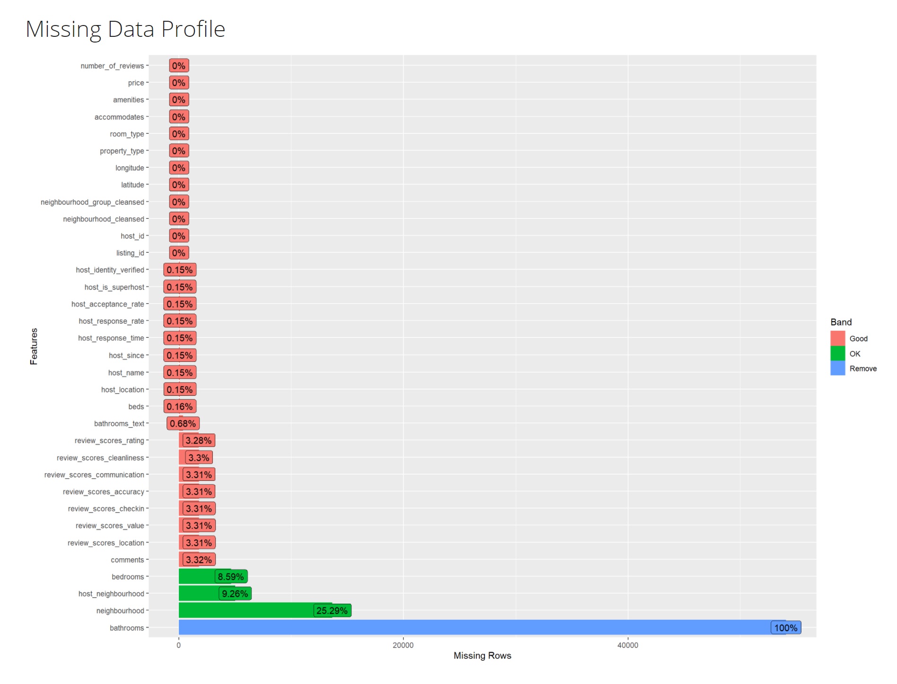
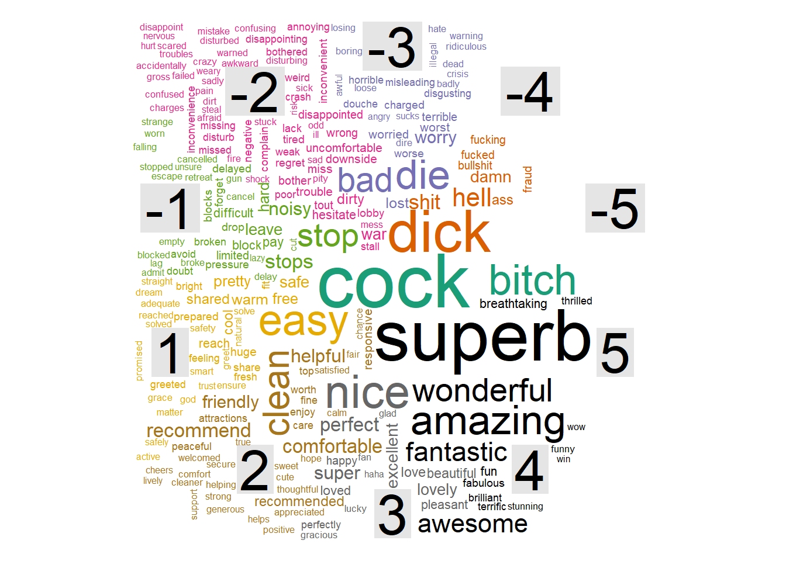
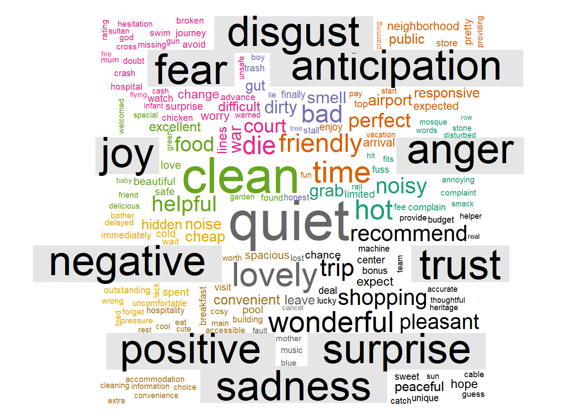

# Prototype testing for the Exploratory module for OurShinyPET


by [Joey Chua](https://www.linkedin.com/in/joeychuasm/)

---


# Introduction 

Airbnb is an online vacation rental marketplace servicing a community of hosts and travellers. The diagram below shows the process of how Airbnb started with two individuals who could not pay for rent in 2007 to starting a company that reached US$10 billion valuation by 2014.In 2020, Airbnb went public with valuation of up to US$47 million. [valuation of up to US$47 million](https://blog.seedly.sg/airbnb-ipo/)


[Adapted from Adioma](https://blog.adioma.com/how-airbnb-started-infographic/)


According to [Airbnb](https://news.airbnb.com/2020-update/), Airbnb has millions of listings in over 220 counties and regions across 100,000 cities. The data generated provides rich information, including structured data e.g. price and location, as well as unstructured data e.g. reviews and listing descriptions. While there are statistical and analytic tools available to derive insights using these data, these tools are often subscription-based and require technical knowledge, which may not be available or accessible to everyone. Hence, this project aims to develop an interface which is concise, interactive, and user-friendly using R Shiny. With this interface, data-based decisions can be made from the interactive GUI. The R Shiny app will cover exploratory data analysis, confirmatory data analysis, text mining, as well as predictive analysis. 

This assignment is sub-module of our final Shiny-based Visual Analytics Application (Shiny-VAA). In particular, a focus on text mining utilising various R packages will be presented. The process is shown below: 

## Application Use Case 

Our application can be used from both the perspective of hosts and guests.

**Hosts**: In 2014, Airbnb launched the Superhost programme to reward hosts with outstanding hospitality. As a Superhost, one will have better earnings, more visibility, and are able to earn exclusive rewards such as increased earnings compared to regular hosts. To become a Superhost, these are the criteria to be met:
- 4.8 or higher overall rating based on reviews
- Completed at least 10 stays in the past year or 100 nights over at least 3 completed stays
- Less than 1% cancellation rate, not including extenuating circumstances
- Responds to 90% of new messages within 24 hours 

**Guests**: With over 60,000 members and 6,000 properties listed on Airbnb website, a dilemma on which is the right space might be of concern to users. Various modules in our dashboard will allow both types of users to analyse Airbnb data according to their needs. 

## Data 

[InsideAirbnb](http://insideairbnb.com/get-the-data.html) provides tools and data for users to explore Airbnb. We will be using the following files:
- listing.csv.gz: This dataset consists of 74 variables and 4256 data points.  
- reviews.csv.gz: This dataset provides 6 variables and 52368 data points.  
While the team has decided to use the latest set of data compiled on 27 January 2021, this report uses data compiled on 29 December 2020 for completeness. 

# Literature Review

_Conducting literature review on how the analysis were performed before. The focus should be on identifying gaps whereby interactive web approach and visual analytics techniques can be used to enhance user experience on using the analysis techniques._


Airbnb data has been widely used for text mining in tools like Python and R. In Python, (Natural Language Processing Toolkit)[https://www.nltk.org/] has easy-to-use interfaces to over 50 corpora and lexical resource, as well as a wide range of text processing libraries for tokenisation, stemming, classification etc. Similarly, R has extensive libraries such as tidyverse and Shiny which allows for text mining and building of interactive dashboards. 

Zhang (2019) used text mining approaches including content analysis and topic modelling (Latent Dirichlet Allocation (LDA) method) to examine over 1 million Airbnb reviews across 50,933 listings in the United States of America (USA). Kiatkawsin, Sutherland & Kim (2020) also used LDA method to compare reviews between Hong Kong and Singapore. However, these articles do not provide visualiation of the methods used and are not interactive. 

[Kim's Shiny Airbnb App](https://donghwikim21.shinyapps.io/ShinyAirbnb/) provided dashboard which is interactive for Exploratory Data Analysis (EDA), but left out reviews. [Ankit Pandey](https://github.com/ankit2web/Twitter-Sentiment-Analysis-using-R-Shiny-WebApp) provided a more comprehensive text analytics dashboard using wordcloud and polarity of sentiments, but does not provide much interactivity. 

To solve the above gaps, the next section outlines the steps:

# Submodules 

## Data Preparation

_Extracting, wrangling and preparing the input data required to perform the analysis. The focus should be on exploring appropriate tidyverse methods_

### R Markdown

runtime:shiny was added to allow dynamic documentation.
{r} part of the code chunk can be used to specify elements and subsequently rendered into different format.
echo=TRUE is set to allow printing of code chunk when rendered into a different file format.
More details can be found at [R Markdown Documentation](https://rmarkdown.rstudio.com/lesson-1.html).

### Packages

To install multiple packages and load the libraries, run the following codes chunk:


```r
packages <- c("tidyverse","sf","tmap","crosstalk","leaflet","RColorBrewer","ggplot2",
              "rgdal", "rgeos", "raster","maptools","tmaptools","shiny","tidytext",
              "wordcloud","wordcloud2","tm","ggthemes","igraph","ggmap","DT",
              "reshape2","ggraph","topicmodels","tidytext","topicmodels","quanteda",
              "tm","RColorBrewer","DataExplorer", 'widgetframe', 'knitr')

for (p in packages){
  if (!require(p,character.only=T)){
    install.packages(p)
  }
  library(p, character.only=T)
}
```

### Import Data

Use the read_csv() function to determine the path to the file to read. It prints out a column specification that gives the name and type of each column. 
As the are unnecessary columns, select() function is use to retain only the columns used in subsequent analysis. 
- review file contains 52367 observations with 6 variables; 2 columns (listing_id and comments) are retained.
- listings file contains 4255 observations with 74 variables; 33 columns are retained.


```r
reviews <- read_csv("./data/reviews.csv")%>% 
  dplyr::select(listing_id,comments)
```

```
## 
## -- Column specification --------------------------------------------------------
## cols(
##   listing_id = col_double(),
##   id = col_double(),
##   date = col_date(format = ""),
##   reviewer_id = col_double(),
##   reviewer_name = col_character(),
##   comments = col_character()
## )
```


```r
listings <- read_csv("./data/listings.csv")  %>% 
  rename(listing_id=id) %>% 
  dplyr::select(-c(listing_url, scrape_id, last_scraped, name, picture_url,host_url, host_about,host_thumbnail_url, host_picture_url, host_listings_count, host_verifications,calendar_updated,first_review,last_review,license,neighborhood_overview,description,host_total_listings_count,host_has_profile_pic,availability_30,availability_60,availability_90,availability_365,calculated_host_listings_count,calculated_host_listings_count_entire_homes,calculated_host_listings_count_private_rooms,calculated_host_listings_count_shared_rooms,reviews_per_month,minimum_nights,maximum_nights,minimum_minimum_nights,maximum_minimum_nights,minimum_maximum_nights,maximum_maximum_nights,number_of_reviews_ltm,number_of_reviews_l30d,minimum_nights_avg_ntm,maximum_nights_avg_ntm,calendar_last_scraped,has_availability,instant_bookable))
```

```
## 
## -- Column specification --------------------------------------------------------
## cols(
##   .default = col_double(),
##   listing_url = col_character(),
##   last_scraped = col_date(format = ""),
##   name = col_character(),
##   description = col_character(),
##   neighborhood_overview = col_character(),
##   picture_url = col_character(),
##   host_url = col_character(),
##   host_name = col_character(),
##   host_since = col_date(format = ""),
##   host_location = col_character(),
##   host_about = col_character(),
##   host_response_time = col_character(),
##   host_response_rate = col_character(),
##   host_acceptance_rate = col_character(),
##   host_is_superhost = col_logical(),
##   host_thumbnail_url = col_character(),
##   host_picture_url = col_character(),
##   host_neighbourhood = col_character(),
##   host_verifications = col_character(),
##   host_has_profile_pic = col_logical()
##   # ... with 17 more columns
## )
## i Use `spec()` for the full column specifications.
```

### Merge Data

right_join() is used to merge the listings and review files so that all rows from listings will be returned. 


```r
data <- right_join(reviews,listings,by="listing_id")
```

### Save file

To write to CSV for future usage, run the following code without hashtag(#).


```r
#write.csv(data,"data.csv")
```

### View data


```r
glimpse(data)
```

```
## Rows: 54,074
## Columns: 34
## $ listing_id                   <dbl> 49091, 50646, 50646, 50646, 50646, 50646,~
## $ comments                     <chr> "Fran was absolutely gracious and welcomi~
## $ host_id                      <dbl> 266763, 227796, 227796, 227796, 227796, 2~
## $ host_name                    <chr> "Francesca", "Sujatha", "Sujatha", "Sujat~
## $ host_since                   <date> 2010-10-20, 2010-09-08, 2010-09-08, 2010~
## $ host_location                <chr> "Singapore", "Singapore, Singapore", "Sin~
## $ host_response_time           <chr> "within a few hours", "a few days or more~
## $ host_response_rate           <chr> "100%", "0%", "0%", "0%", "0%", "0%", "0%~
## $ host_acceptance_rate         <chr> "N/A", "N/A", "N/A", "N/A", "N/A", "N/A",~
## $ host_is_superhost            <lgl> FALSE, FALSE, FALSE, FALSE, FALSE, FALSE,~
## $ host_neighbourhood           <chr> "Woodlands", "Bukit Timah", "Bukit Timah"~
## $ host_identity_verified       <lgl> TRUE, TRUE, TRUE, TRUE, TRUE, TRUE, TRUE,~
## $ neighbourhood                <chr> NA, "Singapore, Singapore", "Singapore, S~
## $ neighbourhood_cleansed       <chr> "Woodlands", "Bukit Timah", "Bukit Timah"~
## $ neighbourhood_group_cleansed <chr> "North Region", "Central Region", "Centra~
## $ latitude                     <dbl> 1.44255, 1.33235, 1.33235, 1.33235, 1.332~
## $ longitude                    <dbl> 103.7958, 103.7852, 103.7852, 103.7852, 1~
## $ property_type                <chr> "Private room in apartment", "Private roo~
## $ room_type                    <chr> "Private room", "Private room", "Private ~
## $ accommodates                 <dbl> 1, 2, 2, 2, 2, 2, 2, 2, 2, 2, 2, 2, 2, 2,~
## $ bathrooms                    <lgl> NA, NA, NA, NA, NA, NA, NA, NA, NA, NA, N~
## $ bathrooms_text               <chr> "1 bath", "1 bath", "1 bath", "1 bath", "~
## $ bedrooms                     <dbl> 1, 1, 1, 1, 1, 1, 1, 1, 1, 1, 1, 1, 1, 1,~
## $ beds                         <dbl> 1, 1, 1, 1, 1, 1, 1, 1, 1, 1, 1, 1, 1, 1,~
## $ amenities                    <chr> "[\"Washer\", \"Elevator\", \"Long term s~
## $ price                        <chr> "$80.00", "$80.00", "$80.00", "$80.00", "~
## $ number_of_reviews            <dbl> 1, 18, 18, 18, 18, 18, 18, 18, 18, 18, 18~
## $ review_scores_rating         <dbl> 94, 91, 91, 91, 91, 91, 91, 91, 91, 91, 9~
## $ review_scores_accuracy       <dbl> 10, 9, 9, 9, 9, 9, 9, 9, 9, 9, 9, 9, 9, 9~
## $ review_scores_cleanliness    <dbl> 10, 10, 10, 10, 10, 10, 10, 10, 10, 10, 1~
## $ review_scores_checkin        <dbl> 10, 10, 10, 10, 10, 10, 10, 10, 10, 10, 1~
## $ review_scores_communication  <dbl> 10, 10, 10, 10, 10, 10, 10, 10, 10, 10, 1~
## $ review_scores_location       <dbl> 8, 9, 9, 9, 9, 9, 9, 9, 9, 9, 9, 9, 9, 9,~
## $ review_scores_value          <dbl> 8, 9, 9, 9, 9, 9, 9, 9, 9, 9, 9, 9, 9, 9,~
```

glimpse() does not present the data in a tabular format, hence datatable and kable packages were considered.However,
- datatable() does not work well with the extensions of FixedColumns, FixedHeader and Scoller when coupled with Shiny. Hence, these specific functionalities are excluded.
- kable() is not up to date with the current version of R and was not used.


```r
dt_reviews <- datatable(reviews)
```

<iframe seamless src="html/dt_reviews.html" width="120%" height="600"></iframe>

## Exploratory Data Analysis (EDA)

EDA is conducted briefly to allow a summary of the data's main characteristics and identify any potential issues that may arise. 
- [ggplot](https://ggplot2.tidyverse.org/) is commonly used to map variables to aesthetics. However, plotting each graph is tedious thus will not be used.
- [DataExplorer](https://www.rdocumentation.org/packages/DataExplorer/versions/0.8.2) is similar to ProfilerReport() in Python, which automates data handling and visualisation. This allows more time and focus on understanding the underlying data, as well as to study and extract insights.

To generate a report, run the following code without the hashtag(#)


```r
#create_report(data)
```

Missing data profile, univariate distribution and bar chart with frequency can be observed.




## Text Mining

_Testing and prototyping the proposed sub-module in R Markdown. The R Markdown document must be in full working html report format. This link1 and link2 provides useful examples for your reference._

A comparison of various packages are shown below: 


### Tidy Text Format 


For easier and more effective data handling, this section outlines the steps to ensure tidy data i.e. each variable is a column, each observation is a row and each type of observational unit is a table. In other words, tidy text becomes a table with one-token per row. 


***Data Types***

- To change host_since into date format, use as.data(). 
- To change listing_id data type to categorical, use as.character().


```r
data$host_since <- as.Date(data$host_since, format = '%d/%m/%Y')
data$listing_id <- as.character(data$listing_id)
```

***Cleaning***

- To remove anything but alphabets, use gsub()
- To change all alphabets to lowercase, use tolower()
- To remove dollar sign in price, use str_remove()
- To remove backslash in amenities, use gsub()
- To remove locations not in normalised singapore text, use subset()
- To drop rows
- To remove Non-ASCII characters including Chinese, Japanese, Korean etc, use iconv()


```r
data$comments <- gsub("^[alpha:][:space:]'\"]", " ",data$comments) %>% 
  tolower()
data$comments <- iconv(data$comments,to="UTF-8")


data$price <- str_remove(string=data$price,pattern='\\$') %>% 
  as.numeric()
data$host_response_rate <- gsub("%","",data$host_response_rate) 
data$amenities <- gsub('\"', "", data$amenities, fixed = TRUE)
data <- subset(data,host_location=="Singapore" | host_location=="Singapore, Singapore" | host_location=="SG")
```

**Stop Words**
Due to the following reasons, additional stop words are added:
- reviews/comments mentioned names consistently, and they are not relevant to analysis
- stop_words is not comprehensive enough


```r
new_stopwords <- c("michelle's","elizabeth","yuan","felix","anita","susan","eddie","eddie's","edwin","belinda","besan","nargis","antonio","sharm","tim","kathleen","stteven","jerome","freddy","eunice","eunice's","vivian","jerome's","mi's","freddy's","joey","tay","michelle","noor","anthony","tay's","carrie","jauhara","susan","karen","jenny","lena","leonard","kingsley","freda","jialin","matthew","fran","na")
all_stopwords <- c(new_stopwords,stop_words)
```

**Unnest tokens**
- unnest_token is used to split a column into tokens such that they are flattened into one-token-per row. 
- anti_join() removes stop words contained in the reviews/comments. 


```r
data_comments <- data %>% 
  dplyr::select(listing_id,comments,review_scores_rating,neighbourhood_cleansed,neighbourhood_group_cleansed)%>%
  unnest_tokens(word,comments) %>% 
  group_by(listing_id) %>% 
  ungroup() %>% 
  anti_join(stop_words)
```

```
## Joining, by = "word"
```

**Frequency**
count() or n() can find the most common words that occurred in the reviews.


```r
data_count <- data_comments %>% 
  group_by(word) %>% 
  summarise(frequency=n())
```

**Wordcloud**
Worldcloud provides an easy way to show how frequent a word appears in a corpus. In wordcloud, the size of a word indicates how frequent the word appears in a given text. 
Costs and benefits of wordcloud:


- [worldcloud](https://www.rdocumentation.org/packages/wordcloud/versions/2.6) was considered. However, there are limitations in terms of flexibility in usage. Additionally, during renderwordcloud seemed to have issue rendering in shiny.
- [wordcloud2](https://www.rdocumentation.org/packages/wordcloud2/versions/0.2.1/topics/wordcloud2) provides more flexibility through usage of font, colour, rotations etc. renderwordcloud2 works better for rendering. However, in R Markdown, the rendering issue appeared for any information that follows the wordcloud. 


```r
tidy_wordcloud <- data_count %>% 
  wordcloud2()
```

<iframe seamless src="html/tidy_wordcloud.html" width="100%" height="500"></iframe> 

For more impactful and better visualisation, the following are taken into considerations:

- colour 


```r
#custom <- wordcloud2(data_cloud,colorPalette = "RdYlBu")
```

- shape and letters


```r
#custom_cloud <- wordcloud2(wordcloud,figPath="airbnb.png")
#letterCloud(wordcloud,word="AIRBNB")
```

- dictionaries (afinn, bing, nrc)

**AFINN**


```r
afinn <- get_sentiments("afinn") 
afinn_sentiments <- data_comments %>% 
  inner_join(afinn) %>% 
  count(word,value,sort=TRUE) %>% 
  acast(word~value,value.var="n",fill=0) %>% 
  comparison.cloud()
```

```
## Joining, by = "word"
```




```r
afinn_count <- data_comments %>% 
  #group_by(listing_id) %>% 
  inner_join(afinn) %>% 
  count(word,value) %>% 
  filter(n>500) %>% 
  #mutate(n=ifelse(sentiment=="negative",-n,n)) %>% 
  mutate(word=reorder(word,n)) %>% 
  ggplot(aes(word,(n)))+
  geom_col()+
  coord_flip()
```

```
## Joining, by = "word"
```


**BING**


```r
bing <- get_sentiments("bing")
bing_sentiments <- data_comments %>% 
  inner_join(bing) %>% 
  count(word,sentiment,sort=TRUE) %>% 
  acast(word~sentiment,value.var="n",fill=0) %>% 
  comparison.cloud(colors = c("red", "blue"))
```

```
## Joining, by = "word"
```




_sorry, please self-censor some words_


```r
bing_count <- data_comments %>% 
  inner_join(bing) %>% 
  count(word,sentiment) %>% 
  filter(n>500) %>% 
  mutate(n=ifelse(sentiment=="negative",-n,n)) %>% 
  mutate(word=reorder(word,n)) %>% 
  ggplot(aes(word,n,fill=sentiment))+
  geom_col()+
  coord_flip()
```

```
## Joining, by = "word"
```


**NRC**


```r
nrc <- get_sentiments("nrc")
nrc_sentiments <- data_comments %>% 
  inner_join(nrc) %>% 
  count(word,sentiment,sort=TRUE) %>% 
  acast(word~sentiment,value.var="n",fill=0) %>% 
  comparison.cloud()
```

```
## Joining, by = "word"
```


```r
nrc_count <- data_comments %>% 
  inner_join(nrc) %>% 
  count(word,sentiment,sort=TRUE) %>% 
  filter(n>1500) %>% 
  mutate(n=ifelse(sentiment=="negative",-n,n)) %>% 
  mutate(word=reorder(word,n)) %>% 
  ggplot(aes(word,n))+
  facet_grid(~sentiment)+
  geom_col()+
  coord_flip()
```


### tm 

**Create corpus**


```r
corpus_review <- Corpus(VectorSource(as_tibble(data$comments)))
```

**Clean corpus**

- Stemming algorithms work by cutting off the end or the beginning of the word, taking into account a list of common prefixes and suffixes that can be found in an inflected word. However, the stemming method changes words such as earlier to earli and checking to checkin as shown above. As such, this process was excluded.
- Lemmatization, on the other hand, takes into consideration the morphological analysis of the words.


```r
corpus_review <- tm_map(corpus_review,tolower)
corpus_review=tm_map(corpus_review, removePunctuation)
corpus_review=tm_map(corpus_review, removeWords, stopwords("english"))
corpus_review=tm_map(corpus_review, removeWords,c("also","is","in","to","with"))
#corpus_review[[1]][1]
```


```r
review_tdm <- DocumentTermMatrix(corpus_review)
review <- as.data.frame(colSums(as.matrix(review_tdm)))
review <- rownames_to_column(review) 
colnames(review) <- c("term", "num")
review <- arrange(review, desc(num))
```


```r
#View the top 10 most common words
#review[1:10]
#barplot(review[1:20], col = "steel blue", las = 2)
```


```r
wordcloud <- wordcloud(review$term, review$num,max.words = 50, colors = "red")
```


### TF-IDF

TF-IDF is short for Term Frequency-Inverse Document Frequency. Term Frequency is the number of times word is found within a document. Invest Document Frequency is the inverse number of times word is found in collection of documents. A word which appears frequently within a document but is not frequently found in collection will have high TF IDF score as this word is relevant to the document. 


```r
review_words <- data_comments %>%
  group_by(neighbourhood_group_cleansed ,word) %>% 
  summarise(frequency=n())
```

```
## `summarise()` has grouped output by 'neighbourhood_group_cleansed'. You can override using the `.groups` argument.
```

```r
  #filter(frequency>2000)
  
total_words <- review_words %>% 
  group_by(neighbourhood_group_cleansed) %>% 
  summarise(total=sum(frequency))

airbnbwords <- left_join(review_words,total_words) %>% 
  filter(frequency/total<0.01)
```

```
## Joining, by = "neighbourhood_group_cleansed"
```

```r
neigh_freq <- ggplot(airbnbwords,aes(frequency/total,fill=neighbourhood_group_cleansed))+
  geom_histogram() +
  facet_wrap(~neighbourhood_group_cleansed,scales="free_y")
```


```r
airbnbtfidf <- airbnbwords %>% 
  bind_tf_idf(word,neighbourhood_group_cleansed ,frequency)

airbnbtfidf %>% 
  group_by(neighbourhood_group_cleansed) %>% 
  slice_max(tf_idf,n=15) %>% 
  ungroup() %>% 
  ggplot(aes(tf_idf,fct_reorder(word,tf_idf),fill=neighbourhood_group_cleansed))+
  geom_col()+
  facet_wrap(~neighbourhood_group_cleansed,scales="free")
```


### Topic Modelling (LDA)

Latent Dirichlet allocation is an example of topic modeling algorithm, based on 2 principles: 
1. Every document is a mixture of topics.For example, document A is 90% topic on location and 10% on host's hospitality. Whereas, document B is 30% topic on location and 70% on host's hospitality.
2. Every topic is a mixture of words. For instance, based on Airbnb data, one topic can be cleanliness, and the other topic can on amenities. 

To set the number of topics, set k=x where x is a numerical value. 


```r
airbnb_lda <- LDA(review_tdm, k = 3)
airbnb_topics <- tidy(airbnb_lda, matrix = "beta")
```


```r
airbnb_top_terms <- airbnb_topics %>%
  group_by(topic) %>%
  top_n(10, beta) %>%
  ungroup() %>%
  arrange(topic, -beta)
```


```r
airbnb_top_terms %>%
  mutate(term = reorder_within(term, beta, topic)) %>%
  ggplot(aes(beta, term, fill = factor(topic))) +
  geom_col(show.legend = FALSE) +
  facet_wrap(~ topic, scales = "free") +
  scale_y_reordered()
```


### Geospatial Analysis

shp files are obtained from data.gov [region planning](https://data.gov.sg/dataset/region-census-2010) and [region boundary without sea](https://data.gov.sg/dataset/master-plan-2014-region-boundary-no-sea)

**Data Preparation**


```r
region_data <-data_comments %>% 
  group_by(neighbourhood_group_cleansed) %>% 
  inner_join(afinn) %>% 
  count(word,value) %>% 
  mutate(score=value*n) %>%
  group_by(neighbourhood_group_cleansed) %>% 
  summarise(mean_score=mean(score))
```

```
## Joining, by = "word"
```

```r
region <- datatable(region_data)
```

<iframe seamless src="html/region.html" width="100%" height="500"></iframe>


```r
subregion_data <-data_comments %>% 
  group_by(neighbourhood_cleansed) %>% 
  inner_join(afinn) %>% 
  count(word,value) %>% 
  mutate(score=value*n) %>%
  group_by(neighbourhood_cleansed) %>% 
  summarise(mean_score=mean(score))
```

```
## Joining, by = "word"
```

```r
subregion <- datatable(subregion_data)
```


<iframe seamless src="html/subregion.html" width="100%" height="500"></iframe>

** Read Shape File**


```r
mpsz <- st_read(dsn = "data/geospatial", 
                layer = "MP14_SUBZONE_NO_SEA_PL")%>%
  group_by(PLN_AREA_N) %>%
  summarise(geometry = sf::st_union(geometry))
```

```
## Reading layer `MP14_SUBZONE_NO_SEA_PL' from data source `E:\suyiinang\ourshinyPET\content\english\blog\text\data\geospatial' using driver `ESRI Shapefile'
## Simple feature collection with 323 features and 15 fields
## Geometry type: MULTIPOLYGON
## Dimension:     XY
## Bounding box:  xmin: 2667.538 ymin: 15748.72 xmax: 56396.44 ymax: 50256.33
## Projected CRS: SVY21
```

**Join Data**

```r
airbnb_clean_region <- right_join(mpsz,region_data, c("PLN_AREA_N" = "neighbourhood_group_cleansed" ))

airbnb_clean_subregion <- right_join(mpsz,subregion_data, c("PLN_AREA_N" = "neighbourhood_cleansed" ))
```


**Create Map**


```r
map <- tm_shape(mpsz)+
  tm_fill("PLN_AREA_N",title="Region",palette = "Reds")+
  tm_borders()+
  tm_layout(legend.outside=TRUE, legend.outside.position="right")
tmap_mode("view")
```

```
## tmap mode set to interactive viewing
```

```r
map <- tmap_leaflet(map) #blogdown unable to render interactive tmap
frameWidget(map)
```

```{=html}
<div id="htmlwidget-bffaaa105d1cbc274416" style="width:100%;height:480px;" class="widgetframe html-widget"></div>
<script type="application/json" data-for="htmlwidget-bffaaa105d1cbc274416">{"x":{"url":"index_files/figure-html//widgets/widget_unnamed-chunk-51.html","options":{"xdomain":"*","allowfullscreen":false,"lazyload":false}},"evals":[],"jsHooks":[]}</script>
```

To allow better visualisation, several factors were taken into consideration:

- Colour
RColourBrewer can be used to select a prefered colour palette that suits the theme of the topic. Sequential colour scheme e.g. from red to white by means of the comman brewer.pal can be used.

- Legend
To change the default title argument, use tmfill(variable, title="Region").
To reposition the legend, use tm_layout(legend.position=c("right","bottom")).To set the legend outside, tm_layout(legend.outside=TRUE, legend.outside.position="right") can be used. 
To set a title for the map, use tm_layout("Title").

# Storyboard

_Preparing the storyboard for the design of the sub-module._

The shiny app submodule will have tabs for
- Data
- Token Frequency/Wordcloud
- Sentiment Analysis 
- Topic Modeling 
- Network Analysis
- Geospatial Analysis


## Install Shiny Packages


```r
shinypackages <- c("shiny","shinydashboard","DT")

for (p in shinypackages){
  if (!require(p,character.only=T)){
    install.packages(p)
  }
  library(p, character.only=T)
}
```

```
## Loading required package: shinydashboard
```

```
## 
## Attaching package: 'shinydashboard'
```

```
## The following object is masked from 'package:graphics':
## 
##     box
```

## Buttons

Various [Widgets](http://shinyapps.dreamrs.fr/shinyWidgets/) are considered.

### Data 

To allow flexibility, shiny application would allow users to upload files for further visualisation. Steps to upload file:

1. Select "Browse.."
2. Locate and select merged CSV file to be uploaded
3. After uploading, the variables will be autopopulated

Variables to be shown in datatable can be chosen in 2 ways:
1. Typing to search for a variable
2. Scroll and select


### Token Frequency

In the second tab, the token frequency would show the word cloud based on the following buttons:

1. Number of words: The slider allows input of single values and ranges.


```r
sliderTextInput(
   inputId="Id096",
   label="Choose a range:", 
   choices=c(1, 10, 100, 500, 1000),
   grid=TRUE
)
```

2. Stopwords: The text input button allows users to decide the stop words they want to add in.


```r
textInput(
   inputId="Id096",
   label="Input Text:", 
   grid=TRUE
)
```

3. Theme of Wordcloud: Wordcloud2 has functions for creating wordcloud theme. 


```r
tidy_wordcloud+WCtheme(1)
tidy_wordcloud+WCtheme(2)
tidy_wordcloud+WCtheme(3)
tidy_wordcloud+WCtheme(2) + WCtheme(3)
```


4. N-gram (mono, bi, tri)


# Annex

Kiatkawsin, K., Sutherland, I., & Kim, J. (2020). A Comparative Automated Text Analysis of Airbnb Reviews in Hong Kong and Singapore Using Latent Dirichlet Allocation. Sustainability (Basel, Switzerland), 12(16), 6673–. https://doi.org/10.3390/su12166673


Zhang, J. (2019). What’s yours is mine: exploring customer voice on Airbnb using text-mining approaches. The Journal of Consumer Marketing, 36(5), 655–665. https://doi.org/10.1108/JCM-02-2018-2581


---
Label vector created by freepik - www.freepik.com
