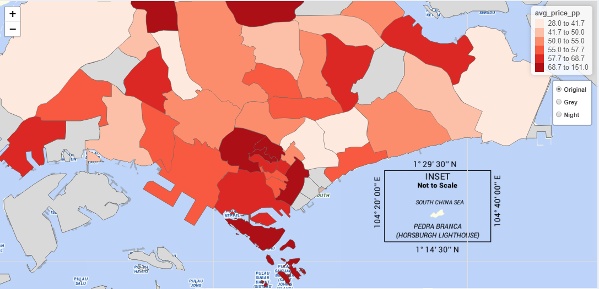

```{r setup, include=FALSE}
library(knitr)
knitr::opts_chunk$set(echo = FALSE, fig.pos = "H", fig.align='center')
```
  
*Keywords* - Airbnb, Exploratory Analysis, Confirmatory Analysis, Text Mining, Predictive Analytics, Decision Making, R Shiny, Interactive Data Visualisation.

# Introduction

With increasing affordable data storage and processing technologies, the demand for data-driven decision-making (DDDM)^[DDDM refers to the systematic analysis, examination and integration of data to making strategic decisions, rather than based on intuition or observation alone (Mandinach, 2012) [@doi:10.1080/00461520.2012.667064]] has increased significantly. As Geoffrey Moore opines, “Without big data analytics, companies are blind and deaf, wandering out onto the Web like deer on a freeway.”. With the use of data driven decision making through analytics tools, firms performance would improve (Yasmin, M et al., 2020) [@https://doi.org/10.1016/j.jbusres.2020.03.028]

Airbnb is an online vacation rental maravailableketplace servicing a community of hosts and travellers. By 2020, Airbnb has millions of listings in over 220 counties and regions across 100,000 cities [@airbnb2021]. The data generated provides rich information, including structured data e.g. price and location, as well as unstructured data e.g. reviews and listing descriptions. Thus, Airbnb provides a good use case and base case for exploratory and confirmatory analysis, text mining, and predictive modeling as presented in our ShinyPET dashboard. 

# Motivation of the application

The motivation of this project stems from two main issues - the proliferation of data and lack of user-friendly tools to make data-driven decision. According to Harris (2012) [@harris_2014], data is impractical without the ability to analyse it. Although there is a wide range of commercial statistics and analytics tools, these tools are often subscription-based and require technical knowledge to mine and draw insights from. On the other hand, while open source tools as such Python and R allow for data visualisations, users would require extensive programming background to generate such insights.

Hence, this project aims to develop an interface which is concise, interactive, and user-friendly using R Shiny. With this interface, data-based decisions can be made from the interactive GUI. The R Shiny App will cover 3 modules:
1) Exploratory - users are able to draw interesting patterns based on selected variables, which are augmented by statistical tests based on the chosen variables. 
2) Text - users are able to perform analysis on textual data such as reviews to generate quantitative insights.    
3) Predictive - users are able to prepare and build a variety of prediction models without the need to have in-depth understanding of predictive models and their algorithms.  
This application can be extended to Airbnb data from other countries, and also to other datasets.

# Review and critic on past works

Radiant application [@radiant2019], an open-source platform-independent browser-based interface for business analytics in R, illustrates the robustness of Rshiny for web-based application. Developed to promote quick and reproducible data analytics, the application provides interactivity and flexibility in performing visualisation, statistical and predictive analysis. However, there are limitations to the application. First, in terms of exploratory data analysis, most of the plots produced are of static nature which can be enhanced by wrapping plotly around them. Secondly, for statistical testing, users are expected to have a basic understanding of statistical testing methods as they are first required to select their testing method, which can be further enhanced by automating testing methods based on inputs. In addition, newer packages such as visNetwork can be applied for interactive tree visualisation that in turn improves the assessment of decision tree model. Lastly, the statistical testing and charts are placed in separate tabs. In terms of visualisation, a single-page view would enhance the aesthetics and usability. 


Text Mining with R Book [@robinson] authored by Silge and Robinson presents a comprehensive approach to handle text. First, the book is content-heavy, which may not be appealing to the typical users. Second, tidytext used for data wrangling and visualisation is widely used, thus allowing users to apply such methods easily. However, these tools require technical skills from users and are not interactive. To allow easy usage and enhance interactivity, packages such as plotly and highchart can be used. Highcharter has various themes and features such as tooltips which greatly enhance visualisation.    


Tidymodels [@tidymodels2020] has gained interest by providing a framework for predictive modeling and machine learning. It is aligned with the tidyverse principles which leads to a tidier and consistent grammar in the predictive analytics process. Different models offered in Radiant package are also available for implementation in Tidymodels framework, which is why our application leverages Tidymodel as the main framework to conduct predictive analytics on Airbnb data.


Lu, Y., Garcia, R., Hansen, B. et al. (2017) [@https://doi.org/10.1111/cgf.13210] provides a comprehensive summary of research on Predictive Visual Analytics. The paper discusses how visual analytics systems are implemented to support predictive analytics process such as feature selection, incremental learning, model comparison and result exploration. The overall goal of visual analytics is to support explanation in each step of predictive analytics exercise which is also our motivation in developing this application.


# Design framework

The design of our shinyPET is based on ensuring a comprehensive data analysis coupled with aesthetics. Taking into account the user point of view, 3 main principles, namely user-friendliness, interactivity and ease of understanding are adopted. 

To get started, the introduction page provides an overview of the application. This allow users to have an understanding of the case that he/she will be exploring. 

In the exploratory module (section 4.1), data summary and their tabular form would be presented for user's understanding of data. In the explore sub tab, users are able to visualise provided data based on various variables. This user-friendliness and interactivity provides flexibility and ease of use without needing any technical knowledge. In the text module (section 4.2), various text mining technique tools are presented. Each sub tab utilises visusaliation tools like word clouds and topic modeling to simplify concepts in natural language processing. This aids in understanding of the unstructured data provided. In the predictive module (section 4.3), various predictive models are available for user selection. The sub tabs guide users through the process from data sampling to final model selection. Visualisation and interactivity are embedded through graphs and user input menu to provide an organised workflow of predictive analytics. Aesthetically, the application's colour scheme should be based on the theme of the topic. Using our case of Airbnb, the official colours are Raush, Babu and Foggy (type of gray). 

The combination of the 3 principles are consistently incorporated into various steps of the data analysis in the 3 modules, hence providing users an easy and comprehensive way to make data-driven decisions.

## Exploratory module

The exploratory module enables users to perform Exploratory Data Analysis (EDA) and Confirmatory Data Analysis (CDA) on selected variables to identify interesting patterns. There are three sections in this module - observe, map and confirm & explore.

### Observe submodule

In Figure [1], the Observe section provides a summary of the data to facilitate users to understand and form questions surrounding the data.
```{r fig.cap='Interface and components of Observe section', out.width="100%"}
include_graphics("images/design_observe.png")
```
2 main components are presented in this section. The first component is the 4 boxes at the top of the page, which present an overview of the data by showing the number of variables, observations and data types. The second component is the summary of each variable according to their data types in a tabular format. Users are able to use the search boxes to filter data, and use the arrow icons to sort data. Hence, these components incorporate both ease of understanding and interactivity.

### Map submodule

Figure [2] shows the Map section that allows user to explore the geographic patterns through thematic maps. The maps are designed based on the three principles stated above and partially on Shneiderman's interactive dynamics principle of "overview, zoom and filter, then details on demand". 'zoom and filter' portion were not used as they are not applicable to this dataset.
```{r fig.cap='Interface and components of Map section', out.width="100%"}
include_graphics("images/design_map.png")
```
There are 2 main components to submodule - the map which consist of bubble map and cloropleth map, and the table, which provides details of the map. These maps are chosen as they are deemed to fit the understanding of the data. For instance, price and review scores are used to show the price and score ranges spread shown by the intensity of the colour. 

### Explore and confirm submodule

Figure [3] shows the EDA and CDA submodule for users to explore and perform inferential statistics based on the section 4.1.1 and 4.1.2.
```{r fig.cap='Interface and components of Explore and Confirm section', out.width="100%"}
include_graphics("images/design_explore1.png")
```
There are 3 main components - the selection input on the left, the statistical results and the chart. The selection input with drop-down list allow users to customise charts shown. The application provides for 4 types of chart namely: distribution, mosaic, boxplot and scatter plot. Based on the selection input, drop-down menus for variables will be altered accordingly. For example, if 'Distribution' chart was selected, only the x-variable drop-down input will be shown. 

The chart was designed based on Shneiderman's interactive dynamics of highlight, filter or manipulate. This graphs allows users to manipulate views by selecting an object in a plot, highlighting selected records and defining a region on the graph. Furthermore, the plotted charts can be downloaded for users to communicate their findings. An example of output is shown in [4].
```{r fig.cap="Graph's manipulation function of the Explore and Confirm section", out.width="100%"}

```
As the application is tailored towards users that are not well-versed in statistics, the statistical tests where test methods and results are automated based on the selected variables, are easy to understand. An interactive slider is also provided for user to easily adjust statistical results.

## Text module
The text module utilises various text mining techniques to transform unstructured text i.e. reviews into structured format to identify patterns and bring about meaningful insights. 

Prior to application of text mining techniques, text preprocessing has to be carried out. This involves the use of tokenisation, stemming and lematisation. Tokenisation is the process of splitting a column of reviews into tokens such that they are flattened into the format of one-token-per-row. Stemming is the process of separating the prefixes and suffixes from words to derive the root word form and meaning. Stemming algorithms work by cutting off the end or the beginning of the word, taking into account a list of common prefixes and suffixes that can be found in an inflected word. Lemmatization, on the other hand, takes into consideration the morphological analysis of the words.

### Token frequency submodule 
To visualise token frequency, wordcloud is used. Worldcloud provides an easy way to show how frequent a word appears in a corpus. In wordcloud, the size of a word indicates how frequent the word appears in a given text. 

Other than considering words as individual units, "ngrams" are also used to tokenise pairs of adajacent words. ngrams provide context in sentiment analysis. For instance, while the word "happy" can be positive, in a sentence which containts the words "not happy" would mean otherwise. Hence, performing sentiment analysis on bigram allow us to examine sentiment-associated words. 
```{r fig.cap='Token Frequency', out.width="100%"}

```
There are two components: on the left is the wordcloud, and on the right is the bar chart the ranks the frequency of word in descending order. From the chart, it can be observed that the words "clean", "stay", "location", and "nice" occurred most frequently. When "bi-gram" is chosen, the wordcloud and bar chart changes accordingly. Tooltip to show the number of times the word occurred when hover over allows users to have understanding of the data. Hence, ease of understanding and interactivity are prominent. 

### Sentiment analysis submodule
In this sub module, 3 dictionaries were used to plot wordcloud that shows both the frequency and sentiments. AFINN lexicon measures sentiment with a numeric score between -5 to 5, BING categorises words as either positive or negative, and NRC categorises words into 8 basic emotions (anger, fear, anticipation, trust, surprise, sadness, joy, and disgust) and 2 sentiments (negative and positive).
```{r fig.cap='Sentiment Analysis', out.width="100%"}

```
Users can select the various lexicons to view the wordcloud and related charts such as bar charts and radial chart. For AFINN and BING, bar charts are plotted to show the spread and weightage of sentiments. For NRC, a radial plot to show the tendency for reviews to lean towards. 

### Topic modelling submodule
Latent Dirichlet allocation (LDA) is an example of topic modeling algorithm, based on 2 principles: First, every document is a mixture of topics. Second, every topic is a mixture of words.

```{r fig.cap='Topic Modelling', out.width="100%"}
include_graphics("images/topicmodelling.png")
```
For flexibility, slider is incorporated to allow users to choose the number of topics and top terms of the topic. As the loading time is long, a "Go" button is included for users to proceed. Subsequently, 2 components are shown. First, the intertopic distance map that uses multidimensional scaling algorithm to plot the topics that have words in common. Second, the bar chart on the right shows salient terms. THe bars exhibit the total frequency of the term.

### Correlation network submodule 
Word occurrences and correlations are commonly used to identify family of words. 

```{r fig.cap='Network Analysis', out.width="100%"}
include_graphics("images/correlationnetwork.png")
```
There are 2 options. First the is Bi-directional Network graph. Second is the Correlation Network graph. These graphs show how words relate to each other. 

## Predictive module
The predictive module design framework follows the Tidymodels framework for data pre-processing, model training, tuning, and validation. On top of that, feature selections are supported by other R packages such as ggcorplot (for correlation matrix), ranger and Boruta (for feature importance). The visualisations and interactivities are embedded in each step of predictive analytics as explained below.

### Data sampling submodule
In this submodule, selection of training-test split proportion provides user with flexibility in deciding how to spend data budget on the model development process. The distribution plot between training and test set displayed highlights potential biases in the training data set.

```{r, echo=FALSE, out.width='100%', fig.cap='Data sampling and distribution plot'}
include_graphics("images/datasplit.PNG")
```

### Feature selection submodule
To support user with selection of variables, correlation matrix with customised correlation type and p-value criteria are provided. In addition, variable importance score from 2 different methods highlight useful predictors towards response variable.
```{r, echo=FALSE, out.width='100%', fig.cap='Correlation matrix and variable importance'}
include_graphics("images/featselect.PNG")
```

### Data transformation submodule
Prior to training, transformation steps are performed using recipe package in Tidymodel. Following transformation steps, plot between pre and post processing step is added to increase user awareness on what transformation steps are performed and on which variables.
```{r, echo=FALSE, out.width='100%', fig.cap='Data transformation steps'}
include_graphics("images/recipetrf.PNG")
```

### Model training submodule
In this sub module, user can select from 5 different types of predictive models for training. For linear regression model, coefficient estimates are shown with option to filter important variables based on p-value. For decision tree training result, visNetwork package is used for its decision tree plot to improve result evaluation.
```{r, echo=FALSE, out.width='100%', fig.cap='Training result evaluation'}
include_graphics("images/mdltrn.PNG")
```
Following, trained model is assessed using test set (unseen data) which is in turn assessed by plotting the actual and predicted value on an Rsquare plot. Table of metric performances such as root mean square, mean absolute error, and Rsquare value is also displayed
```{r, echo=FALSE, out.width='100%', fig.cap='Validation result evaluation'}

```
For linear regression model, users have an option to further evaluate cases with high prediction error. Training set distribution plot is overlapped with predicted values, which may highlight outliers in the predictors. Users can also choose to show N number of top predictor based on p-value score to be displayed.
```{r, echo=FALSE, out.width='100%', fig.cap='Prediction error assessment'}
include_graphics("images/prederror.PNG")
```
Tree based model and generalised linear model use cross validation training set to tune the model's hyper-parameter. Plot of model performance using different hyper-parameters settings are available for user to understand the change in performance.
```{r, echo=FALSE, out.width='100%', fig.cap='Hyper-parameter tuning result'}
include_graphics("images/hypartune.PNG")
```

### Model selection submodule
In the final submodule, all trained and validated models are gathered and their metrics are compared for user to choose the final model. Once selected, user will be able to provide new input variables to each predictor and get the response variable using the selected model.
```{r, echo=FALSE, out.width='100%', fig.cap='Models performance comparison'}
include_graphics("images/mdlcompare.PNG")
```

The combination of these three modules, along with its interactivity and usability would empower users to make data-driven decisions based on the insights generated.

# Case Study : Airbnb Singapore
InsideAirbnb provides tools and data for users to explore Airbnb. 2 files dated  27 January 2021 were used: (1) listing.csv.gz: This dataset consists of 74 variables and 4256 data points (2) reviews.csv.gz: This dataset provides 6 variables and 52368 data points. Our application can be used from both the perspective of hosts and guests.

**Hosts**: In 2014, Airbnb launched the Superhost programme to reward hosts with outstanding hospitality. As a Superhost, one will have better earnings, more visibility, and are able to earn exclusive rewards such as increased earnings compared to regular hosts. To become a Superhost, these are the criteria to be met:
- 4.8 or higher overall rating based on reviews
- Completed at least 10 stays in the past year or 100 nights over at least 3 completed stays
- Less than 1% cancellation rate, not including extenuating circumstances
- Responds to 90% of new messages within 24 hours 
**Guests**: With over 60,000 members and 6,000 properties listed on Airbnb website, a dilemma on which is the right space might be of concern to users. Various modules in our dashboard will allow both types of users to analyse Airbnb data according to their needs. 

In order to reduce the loading time of the application, the datasets were preprocess and only the cleaned datasets were loaded. In addition, redundant variables such as listing id, url id, were removed.

## Geographical distribution of Airbnbs
The point symbol map reveals that the distribution of Airbnb listings in Singapore has high concentration in the central regions. The 4 distinct hotspots are (1) Geylang/Kallang, (2) Lavender/ Rochor / Bugis, (3) Orchard and (4) Chinatown. Area (3) and (4) are mainly tourist areas - (3) Orchard is the main shopping belt of Singapore and (4) Chinatown retains significant historical and cultural landmarks. Areas (1) and (2) are popular given their low prices per person (see choropleth of figure [X]) while staying relatively close to central. Additionally, Airbnb listings tend to be located along the MRT station track, which could signify the use of public transports are generally more popular for Airbnb guests.
```{r fig.cap="Point symbol map on the left, choropleth on the right", out.width="100%"}

```
With this information, potential Airbnb investors can identify highly saturated areas and the average price per person of that area, which could help in estimatation of their investment yield prior to commitment of investments.

## Distribution of review score rating
The overall Airbnb listing review score - 'review_scores_rating', is capped at 100 and has a left-skewed distribution. This suggests that most guests tend to post positive reviews, or listings with low ratings tend to be delisted/exited from Airbnb market. 

```{r fig.cap="Distribution of review score rating", out.width="100%"}

```

## Confirmatory analysis of superhost and review scores hosting
Figure X suggests that listings with the superhost status tend to have higher review scores as indicated the statistical test results where p-value is less than alpha of 0.05. 

```{r fig.cap="Exploratory and Confirmatory Analysis on superhost status and review scores", out.width="100%"}
include_graphics("images/usecase_explore4.png")
```

## Observing correlation among variables
Data sets like Airbnb are rich with large numbers of variable. However, multicolinearity among variables are known to affect predictive model performance. Correlation matrix helps to identify multicolinearity by highlighting variables with high correlation value. In our example below, we observe correlations within rating score components, listing availability period, and review components. With this information, selection of variables can be done properly.
```{r, echo=FALSE, out.width='100%', fig.cap='Correlation among variables'}
include_graphics("images/corrcase.PNG")
```

##Sentiment Analysis
From the wordclouds and polarity clouds, the cleanliness of room seem to be mentioned the most frequently. Additionally, the distance to various areas and transport based on words like "minute walk", "bus stop", and "public transport" seemed to play an important factor to providing ratings and review. Based on the various lexicons, there is a common result of sentiments being skewed towards the positive side. 

## Model Explanation
In predicting listing price using linear model, the plot of coefficient estimate helps to explain the trained model. In the example below, our interface allows sorting of variables based on p-value score where variables with lowest p-value is located on top. Property type which falls under "Others" category (those with counts of less than 5% in the data set) has the lowest p-value score and positive estimate, which may represent unique property type (e.g. boat, campsite, chalet, villa) where the listing price is above the average price of common property type like apartment and condominium (as shown in the boxplot from exploratory module). Amenities and beds are also in the top 5 predictor where it correlates positively with listing price. However, the error bar is wider for property type "Others" as compared to the amenities and beds, representing more uncertainty in the estimate value.
```{r, echo=FALSE, out.width='100%', fig.cap='Coefficient estimate and boxplot from exploratory module'}

```


# Discussion
In this project, we have developed ShinyPET, an interactive web-based application to promote data exploratory, text analytics and predictive analytics on Airbnb data set. The interactivity and functionality of our application provides evidence on the robustness of R shiny as a framework to develop web application, along with the variety of available R packages that serve as building blocks for each module in our application. On top of the functionality, user interface is also carefully designed with the arrangement of submodules for each analytics task, to ease the usage for non-technical user. With the integration of main analytics task (exploratory, textual, and predictive), our application enables user to assess and make use of a dataset from different perspective in a single platform. The modularisation of analytics task allows user to quickly navigate between modules when necessary. Example of benefit from such case has been discussed previously where exploratory module can aid in the understanding of predictive model.

# Future Work
Shiny PET was built in relation to Singapore's Airbnb dataset as a usecase. The Shiny PET enable users to perform exploratory and confirmatory analysis, text mining, and predictive modelling without users needing extensive programming or statistical knowledge. The application could be further enhance by including a data load and wrangling function to accommodate different datasets.

The current types of chart and statistical test are limited to only 4 types of charts and parametric statistical test for each chart type respectively. Other charts, such as violin and bar charts, can be incorporated further. Additional hypothesis testing methods such as non-parametric test for median, statistical test by pairs etc. can be incorporated. The current application supports two types of map, providing room for additions in terms of kernel density map and navigation map

Additionally, token frequencies and sentiment analysis allow selection of n-grams and lexicons respectively. Further interactivity such as choices of neighbourhood, rating scores can be added. Moreover, the explore and text sub modules can be connected with views coordinated and linked in order to provide multiple dimensional exploration. 

The current predictive module is limited to 5 types of predictive model. More predictive models e.g. neural network can be to provide users with wider model selection. In hyper-parameter tuning, parameters can be made available for user input to provide more flexibility in developing predictive model. In-depth statistical analysis in model training such as residual analysis are currently not available and this would be a good additional tool to improve our application.

# Acknowledgement

The authors wish to thank Professor Kam Tin Seong of Singapore Management University for his extensive guidance and support during this project.

# References
