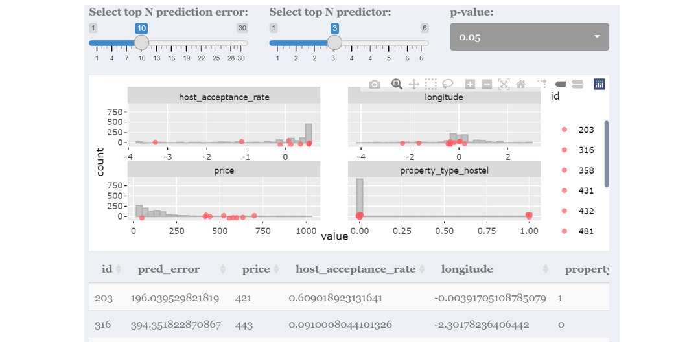

```{r setup, include=FALSE}
library(knitr)
knitr::opts_chunk$set(echo = FALSE, fig.pos = "H", fig.align='center')
```
  
*Keywords* - Airbnb, Exploratory Analysis, Confirmatory Analysis, Text Mining, Predictive Analytics, Decision Making, R Shiny, Interactive Data Visualisation.

# Introduction

With the explosion of affordable data storage and processing technologies, the demand for data-driven decision-making (DDDM) has increased significantly. DDDM refers to the systematic analysis, examination and integration of data to making strategic decisions, rather than based on intuition or observation alone (Mandinach, 2012)[@doi:10.1080/00461520.2012.667064]. As well-published Geoffrey Moore opines, “Without big data analytics, companies are blind and deaf, wandering out onto the Web like deer on a freeway.”  Research by Yasmin, M et al. (2020)[@https://doi.org/10.1016/j.jbusres.2020.03.028] found that the use of data driven decision making through analytics tools had a positive impact on firm performance.

# Motivation of the application

This project was motivated by the increasing demand for data analytics as well as the lack of open source tools for users to perform analytics to undercover meaningful patterns from structured, textual and spatial data.

Although, there is a wide range of commercial statistical and analytics tools available, these tools are often subscription-based and require technical knowledge to mine and draw insights from. Alternatively, open source tools as such R allows for interactive data visualisations, however users would require extensive programming background to generate such insights.

As such, we have developed a free, user-friendly and interactive tool with 3 modules :
1) Exploratory - allows users to identify interesting patterns based on selected variables. Findings from the exploratory module are augmented by a statistical test based on user’s chosen variables.  
2) Text - users can be able to perform analysis on textual data to generate more quantitative insights.    
3) Predictive - enables users to prepare and build a variety of prediction models without needing to have in-depth understanding of the predictive models and its algorithms.  

To achieve our objective, we have used Airbnb data as our baseline as data generated is rich in information, including structured data such as price and location, as well as unstructured data such as reviews and listing descriptions. Thus, with our application, anyone and everyone would be able to make data-based decisions effortlessly.

# Review and critic on past works

Radiant application [@radiant2019], an open-source platform-independent browser-based interface for business analytics in R, illustrate the robustness of Rshiny for web-based application. Developed to promote quick and reproducible data analytics, the application provides interactivity and flexibility in performing visualisation, statistical and predictive analysis. Most of the plots produced are of static nature and can be enhanced by wrapping plotly around them. Furthermore, for statistical testing, users are expected to have a basic understanding of statistical testing methods as they are first required to select their testing method before proceeding, this can be enhanced by automating testing methods based on inputs. Additionally, the statistical testing and visualisation are placed in separate tabs, user experienced can be improved by placing both the visualise and statistical results on a single page. Lastly, more recent package such as visNetwork allows interactive tree visualisation which will improve the assessment of decision tree model.

Lu, Y., Garcia, R., Hansen, B. et al. (2017) [@https://doi.org/10.1111/cgf.13210] provides a comprehensive summary of research on Predictive Visual Analytics. The paper discusses how visual analytics systems are implemented to support predictive analytics process such as feature selection, incremental learning, model comparison and result exploration. The overall goal of visual analytics is to support explanation in each step of predictive analytics exercise which is also our motivation in developing this application.

In R community, Tidymodels [@tidymodels2020] has gained interest by providing a framework for predictive modeling and machine learning. It is aligned with the tidyverse principles which leads to a tidier and consistent grammar in the predictive analytics process. Different models offered in Radiant package are also available for implementation in Tidymodels framework, which is why our application leverages Tidymodel as the main framework to conduct predictive analytics on Airbnb data.


Zhang (2019) used text mining approaches including content analysis and topic modelling (Latent Dirichlet Allocation (LDA) method) to examine over 1 million Airbnb reviews across 50,933 listings in the United States of America (USA). Kiatkawsin, Sutherland & Kim (2020) also used LDA method to compare reviews between Hong Kong and Singapore. However, these articles do not provide visualiation of the methods used and are not interactive.

# Design framework

Our target users for this application are the average users without any programming or extensive statistical knowledge yet wants to make data driven decisions. Thus, the design of Shiny PET is based on 3 main principles - user-friendliness, interactivity and ease of understanding, yet comprehensive enough for users to make data driven decisions. The application's colour scheme is based on Airbnb's official colours - Raush, Babu and Foggy (type of gray). 

The application consist of three modules - Exploratory, Text and Predictive. 

## Exploratory module

The exploratory module enables users to perform exploratory and confirmatory analysis on selected variables to identify interesting patterns. There are three sections in this module - observe, map and confirm & explore.

### Observe submodule

As shown in Figure [1], the Observe section provides a summary of the data for users to quickly understand and form questions surrounding the data. Hence, this section was designed mainly based on ease of understanding principles.
```{r fig.cap='Interface and components of Observe section', out.width="100%"}
include_graphics("images/design_observe.png")
```
There are two main components - first is the top 4 boxes that provide an overview of the data - number of variables, observations and data type. The second component is the tables below shows the summary of each variable by respective data type. The tables allow for some interactivity - search boxes allows user to filter the data accordingly, while the arrow icons next to the variables names allow users to sort the data according to their needs.

### Map submodule

```{r fig.cap='Interface and components of Map section', out.width="100%"}

```

The Map section, Figure [2], the Map section allows user to explore the geographic patterns of Airbnb listings through thematic maps. Thus, this section was designed based on the three principles stated above and partially based on Shneiderman's interactive dynamics principle of "overview, zoom and filter, then details on demand", save for the 'zoom and filter' portion as it was not applicable to this data.

As such, there are 2 main components of this submodule - the map which provides a macro overview of the Airbnb listings by the selected variable. The second component is the table, which provides details of the map.

### Map submodule

The Explore and Confirm section, figure [3], enables user to explore and perform inferential statistics based on their exploration and questions generated from the previous two sections. 

```{r fig.cap='Interface and components of Explore and Confirm section', out.width="100%"}

```

There are 3 main components - the selection input on the left, the statistical results and the chart.

The selection input was designed to be interactive and user-friendly, allowing users to customise charts based on the drop-down list provided. The application provides for 4 types of chart namely: distribution, mosaic, boxplot and scatter plot. In drop down menus will change according to the selected chart type, for example, if the 'Distribution' chart was selected, only the x-variable drop-down input will be shown.

```{r fig.cap="Graph's manipulation function of the Explore and Confirm section", out.width="100%"}
include_graphics("images/design_explore2.png")
```

The chart was designed according to Shneiderman's interactive dynamics of highlight, filter or manipulate. This graph allows for users to manipulate views by selecting a single object in a plot, highlighting selected records and defining a region on the graph. Furthermore, the plotted chart can be downloaded for users to communicate their findings. See figure [4] for examples

Given that the application is tailored towards users that are not well versed in statistics, the statistical test was designed to be easy to understand, thus the test methods and results are automated based on the selected variables. An interactive slider is provided for user to easily adjust statistical test.

## Text module
The text module usitlise various text mining techniques to transform unstructured text i.e. reviews into structured format to identify patterns and bring about meaninigful insights. 

Prior to application of text mining techniques, text preprocessing has to be carried out. This involves the use of tokenisation, stemming and lematisation. Tokenisation is the process of splitting a column of reviews into tokens such that they are flatenned into the format of one-token-per-row. Stemming is the process of seperating the prefixes and suffixes from words to derive the root word form and meaning. Stemming algorithms work by cutting off the end or the beginning of the word, taking into account a list of common prefixes and suffixes that can be found in an inflected word. However, the stemming method changes words such as earlier to earli and checking to checkin as shown above. As such, this process was excluded.Lemmatization, on the other hand, takes into consideration the morphological analysis of the words.

### Token Frequency Submodule 
To visualise token frequency, wordcloud is commonly used. Worldcloud provides an easy way to show how frequent a word appears in a corpus. In wordcloud, the size of a word indicates how frequent the word appears in a given text. 

Other than condisdering words as individual units, "ngrams" are also used to tokenise pairs of adajacent words. ngrams provide context in sentiment analysis. For instance, while the word "happy" can be positive, in a sentence which containts the words "not happy" would mean otherwise. Hence, performing sentiment analysis on bigram allow us to examine sentiment-associated words. 

```{r fig.cap='Interface and components of Explore and Confirm section', out.width="100%"}
include_graphics("images/tokenfrequency.png")
```

There are two components: on the left is the wordcloud, and on the right is the bar chart the ranks the frequency of word in descending order. From the chart, it can be observed that the words "clean", "stay", "location", and "nice" occurred most frequently. This could suggest that cleanliness of the environement/room is mentioned the most; it could mean that travellers generally prefer clean room. Additionally, location is mentioned the second-most, suggesting that a location nearer to city for convenience, or q quiet location is important as customers.  


### Sentiment Analysis Submodule
In this submodeule, 3 dictionaries were used to plot wordcloud that shows both the frequency and sentiments. First, AFINN lexicon measurs sentiment with a numeric score between -5 to 5. BING categorises words as either positive or negative. NRC categorise words into emotions.

```{r fig.cap='Interface and components of Explore and Confirm section', out.width="100%"}
include_graphics("images/sentimentanalysis.png")
```

Users can select the various lexicons to view the wordcloud. To further value add to the wordcloud, a further visualisation is conducted. For AFINN, bar chart is plotted to show the spread and weightage of sentiments. For BING, the distribution of negative, positive and netural sentiments are shown. For NRC, a radial plot to show the tendency for customers to lean towards is shown. From the chart, it shows that sentiments generally lean towards positive and joy, while less on sadness and surprise. 

### Topic Modelling Submodule
Latent Dirichlet allocation is an example of topic modeling algorithm, based on 2 principles: 1. Every document is a mixture of topics.For example, document A is 90% topic on location and 10% on host’s hospitality. Whereas, document B is 30% topic on location and 70% on host’s hospitality. 2. Every topic is a mixture of words. For instance, based on Airbnb data, one topic can be cleanliness, and the other topic can on amenities.

```{r fig.cap='Interface and components of Explore and Confirm section', out.width="100%"}
include_graphics("images/topicmodelling.png")
```

Users are able to select the number of topics they would like to understand further. For isntance, by selecting 2 topics, we can observe that the most common word in topic 1 is "x", "y", "z". THe most common words in topic 2 include "a", "b", "c". We can also observe that there are overalapping topics. An example of usage in topic modelling would be to improve search algorithe,/suggestions for usesr. By anyalysing the topics and develop subtopics, the most relevant listings e.g. cleanest room, or closest location could be shown to the users.

### Correlation Network Submodule 
Word occurences and correlations are commonly used to identify family of words. 

```{r fig.cap='Interface and components of Explore and Confirm section', out.width="100%"}

```

There are 2 options. First the is X graph. 
Second is the X graph. From the diagram, is can be seen that thereis strong connection between words such as "X" and "X", "Y" and "Y" and "Y". 

## Predictive module
Our predictive module design framework follows Tidymodels framework for data pre-processing, model training, tuning, and validation. On top of that, feature selection are supported by other R packages such as ggcorplot (for correlation matrix), ranger and Boruta (for feature importance). The visualisation and interactivity are embedded in each step of predictive analytics as explained below.

Data sampling - Selection of training-test split proportion provides flexibility in deciding how to spend data budget on the model development process. The distribution plot between training and test set highlights any potential bias in the training data set.
```{r, echo=FALSE, out.width='100%', fig.cap='Data sampling and distribution plot'}

```
Feature selection - Correlation matrix with customised correlation type and p-value criteria, as well as variable importance allow assessment of correlation among variables.
```{r, echo=FALSE, out.width='100%', fig.cap='Correlation matrix and variable importance'}
include_graphics("images/featselect.PNG")
```
Data transformation - Transformation steps from recipe package and plot between pre and post processing step increases user awareness on what transformation steps are performed and on which variables.
```{r, echo=FALSE, out.width='100%', fig.cap='Data transformation steps'}
include_graphics("images/recipetrf.PNG")
```
Model training - Coefficient estimate or decision tree information as interactive plot to improve result evaluation.
```{r, echo=FALSE, out.width='100%', fig.cap='Training result evaluation'}
include_graphics("images/mdltrn.PNG")
```
Model validation - Rsquare plot to visualise validation result along with table of metric performance.
```{r, echo=FALSE, out.width='100%', fig.cap='Validation result evaluation'}
include_graphics("images/mdleval.PNG")
```
Prediction error assessment - Training set distribution plot is overlapped with predicted values to allow further assessment on prediction error.
```{r, echo=FALSE, out.width='100%', fig.cap='Prediction error assessment'}

```
Hyper-parameter tuning - Plot of model performance using different hyper-parameters setting helps user to understand the change in performance.
```{r, echo=FALSE, out.width='100%', fig.cap='Hyper-parameter tuning result'}
include_graphics("images/hypartune.PNG")
```
Model selection - Plot of performance metrics from different models to support model selection process.
```{r, echo=FALSE, out.width='100%', fig.cap='Models performance comparison'}

```

The combination of these three modules along with its interactivity and usability would empower users to make data driven decisions with the insights generated.

# Case Study : Airbnb Singapore

We selected Airbnbs in Singapore data as our case study due to its variety of data - structured, textual and location data.

Since founded in 2008, Airbnb has revolutionised the tourism industry and has become one of the largest sharing economy. In 2019, Airbnb generated USD4.7b in global revenue with close to 7 million listings on its website[@airbnb2021]. Airbnb plays an important role of connecting hosts and travelers who would not typically interact in absence of the platform. However, given the sheer number of Airbnb listings available, Airbnb hosts face stiff competition not only from other Airbnb hosts, but also from hotels and service apartments. Meanwhile, for Airbnb guests, going through each listings and their reviews on Airbnb website can be quite overwhelming and a tedious process.

Hence, this application allows users to analyse their needs and compare across other listings.

The two main data used for analysis are the listings and reviews of Singapore Airbnb data, which were obtained from InsideAirbnb on the 27 January 2021. The listing dataset contains close to four thousand listings with 74 variables, while the review dataset consist of fifty thousand reviews and 6 variables.

In order to reduce the loading time of the application, the datasets were preprocess prior with only the cleaned dataset loaded. In additional to the usual pre-processing steps, redundant variables such as listing id, url id, were removed. Additionally, unstructured variables were converted into structured variables by counting the length of the text.

## Geographical distribution of Airbnbs

```{r fig.cap="Point symbol map on the left, choropleth on the right", out.width="100%"}
include_graphics("images/usecase_explore.png")
```

The point symbol map reveals that Airbnbs are distributed throughout Singapore, with high concentration around town center. The 4 distinct hotspots are (1) Geylang/Kallang, (2) Lavender/ Rochor / Bugis , (3) Orchard and (4) Chinatown. Area (3) and (4) are mainly tourist areas - (3) Orchard is the main shopping belt of Singapore, while (4) Chinatown retains significant historical and cultural landmarks. Areas (1) and (2) are popular due to its low price per person (see choropleth of figure x) while staying relatively close to town. Additionally, we noticed that Airbnbs tend to be located along the MRT station track. Given that Airbnb guests tend to be more budget conscious, they would most likely use public transportation.

Through the use of these maps, potential Airbnb investor can identify areas that are highly saturated and the average price per person of that area to estimate their investment yield before committing to the investment.

## Distribution of review score rating
  
```{r fig.cap="Distribution of review score rating", out.width="100%"}
include_graphics("images/usecase_explore2.png")
```
  
The overall Airbnb listing review score - 'review_scores_rating', is capped at 100 and has a left skewed distribution. This seems to suggest that either most guests tend to score their reviews positively, or Airbnbs with low ratings tend to delist and exit the Airbnb market. 

## Confirmatory analysis of superhost and review scores hosting

```{r fig.cap="Exploratory and Confirmatory Analysis on superhost status and review scores", out.width="100%"}
include_graphics("images/usecase_explore4.png")
```
  
Figure x suggests that listings with the superhost status tend to have higher review scores as indicated the statistical test results where p-value is less than alpha of 0.05. 

## Observing correlation among variables
Data sets like Airbnb are rich with large numbers of variable. However, multicolinearity among variables are known to affect predictive model performance. Correlation matrix helps us to avoid such case by highlighting variables with high correlation value. In our example below, we observe correlations within rating score components, listing availability period, and review components. With this information, we can then select our variables more wisely.
```{r, echo=FALSE, out.width='100%', fig.cap='Correlation among variables'}
include_graphics("images/corrcase.PNG")
```
## Model explanation
In predicting listing price using linear model, the plot of coefficient estimate helps to explain the trained model. In the example below, our interface allows sorting of variables based on p-value score where variables with lowest p-value is located on top. Property type which falls under "Others" category (those with counts of less than 5% in the data set) has the lowest p-value score and positive estimate, which may represent unique property type (e.g. boat, campsite, chalet, villa) where the listing price is above the average price of common property type like apartment and condominium (as shown in the boxplot from exploratory module). Amenities and beds are also in the top 5 predictor where it correlates positively with listing price. However, the error bar is wider for property type "Others" as compared to the amenities and beds, representing more uncertainty in the estimate value.
```{r, echo=FALSE, out.width='100%', fig.cap='Coefficient estimate and boxplot from exploratory module'}
include_graphics("images/LMcoeff.PNG")
```


# Discussion

What has the audience learned from your work? What new insights or practices has your system enabled? A full blown user study is not expected, but informal observations of use that help evaluate your system are encouraged.

# Future Work

Shiny PET was built with Singapore's Airbnb dataset as a usecase for using R Shiny to perform exploratory and confirmatory, text and predictive analytics without users needing extensive programming or statistical knowledge. Hence, the application could be further enhance by including a data load and wrangling function to accommodate different datasets.

Additionally, the current types of chart and statistical test are limited with only 4 types of charts and parametric statistical test for each chart type respectively. Other charts, such as violin and bar charts, can be incorporated further. Additional hypothesis testing methods can be included such as non-parametric test for median, statistical test by pairs and others. The current application only supports two types of map, other spatial maps such as kernel density map and navigation map can be included. Moreover, the explore and text module can be combined with views coordinated and linked to provide multiple dimensional exploration. 

The current predictive module is limited to 5 types of predictive model. In future, more predictive models can be added to the list, such as neural network to provide user with wider model selection. In terms of hyper-parameter tuning, parameters can be made available for user input to provide more flexibility in developing predictive model. In-depth statistical analysis in model training such as residual analysis are currently not available and this would be a good additional tool to improve our application.

# Acknowledgement

The authors wish to thank Professor Kam Tin Seong of Singapore Management University for his extensive guidance and support during this project.

# References
