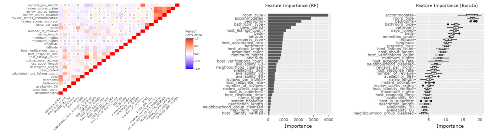
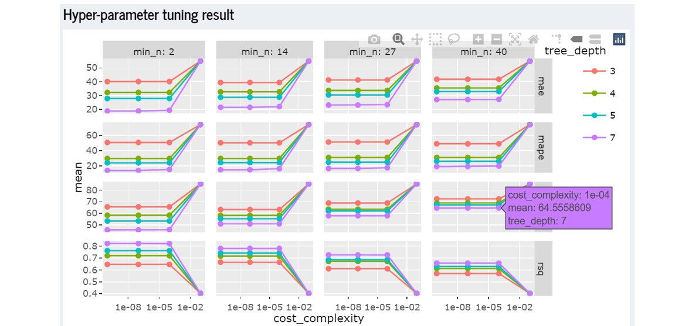

```{r setup, include=FALSE}
knitr::opts_chunk$set(echo = FALSE, fig.pos="H")
library(knitr)
```

# Motivation of the application

xx

# Literature Review

Review and critic on past works


Lu, Y., Garcia, R., Hansen, B. et al. (2017) [@https://doi.org/10.1111/cgf.13210] provides a comprehensive summary of research on Predictive Visual Analytics. The paper discusses how visual analytics systems are implemented to support predictive analytics process such as feature selection, incremental learning, model comparison and result exploration. The overall goal of visual analytics is to support explanation in each step of predictive analytics exercise which is also our motivation in developing this application.

Radiant package, an open-source platform-independent browser-based interface for business analytics in R, illustrate the robustness of Rshiny for web-based application. Developed by Vincent Nijs [@radiant2019] to promote quick and reproducible data analytics, the package provides interactivity and flexibility in performing predictive analysis. Most of the plots produced are of static nature and can be enhanced by wrapping plotly around them. In addition, more recent package such as visNetwork allows interactive tree visualisation which will improve the assessment of decision tree model.

In R community, Tidymodels [@tidymodels2020] has gained interest by providing a framework for predictive modeling and machine learning. It is aligned with the tidyverse principles which leads to a tidier and consistent grammar in the predictive analytics process. Different models offered in Radiant package are also available for implementation in Tidymodels framework, which is why our application leverages Tidymodel as the main framework to conduct predictive analytics on Airbnb data.

# Design framework

A detail description of the design principles used and data visualisation elements built

## Exploratory module

## Text module

## Predictive module
Our predictive module design framework follows Tidymodels framework for data pre-processing, model training, tuning, and validation. On top of that, feature selection are supported by other R packages such as ggcorplot (for correlation matrix), ranger and Boruta (for feature importance). The visualisation and interactivity are embedded in each step of predictive analytics as explained below.

Data sampling - Selection of training-test split proportion provides flexibility in deciding how to spend data budget on the model development process. The distribution plot between training and test set highlights any potential bias in the training data set.
```{r, echo=FALSE, out.width='100%', fig.cap='Data sampling and distribution plot'}
include_graphics("images/datasplit.PNG")
```
Feature selection - Correlation matrix with customised correlation type and p-value criteria, as well as variable importance allow assessment of correlation among variables.
```{r, echo=FALSE, out.width='100%', fig.cap='Correlation matrix and variable importance'}

```
Data transformation - Transformation steps from recipe package and plot between pre and post processing step increases user awareness on what transformation steps are performed and on which variables.
```{r, echo=FALSE, out.width='100%', fig.cap='Data transformation steps'}

```
Model training - Coefficient estimate or decision tree information as interactive plot to improve result evaluation.
```{r, echo=FALSE, out.width='100%', fig.cap='Training result evaluation'}
include_graphics("images/mdltrn.PNG")
```
Model validation - Rsquare plot to visualise validation result along with table of metric performance.
```{r, echo=FALSE, out.width='100%', fig.cap='Validation result evaluation'}
include_graphics("images/mdleval.PNG")
```
Prediction error assessment - Training set distribution plot is overlapped with predicted values to allow further assessment on prediction error.
```{r, echo=FALSE, out.width='100%', fig.cap='Prediction error assessment'}
include_graphics("images/prederror.PNG")
```
Hyper-parameter tuning - Plot of model performance using different hyper-parameters setting helps user to understand the change in performance.
```{r, echo=FALSE, out.width='100%', fig.cap='Hyper-parameter tuning result'}

```
Model selection - Plot of performance metrics from different models to support model selection process.
```{r, echo=FALSE, out.width='100%', fig.cap='Models performance comparison'}
include_graphics("images/mdlcompare.PNG")
```

# Demonstration 

- use case

## Observing correlation among variables
Data sets like Airbnb are rich with large numbers of variable. However, multicolinearity among variables are known to affect predictive model performance. Correlation matrix helps us to avoid such case by highlighting variables with high correlation value. In our example below, we observe correlations within rating score components, listing availability period, and review components. With this information, we can then select our variables more wisely.
```{r, echo=FALSE, out.width='100%', fig.cap='Correlation among variables'}

```
## Model explanation
In predicting listing price using linear model, the plot of coefficient estimate helps to explain the trained model. In the example below, our interface allows sorting of variables based on p-value score where variables with lowest p-value is located on top. Property type which falls under "Others" category (those with counts of less than 5% in the data set) has the lowest p-value score and positive estimate, which may represent unique property type (e.g. boat, campsite, chalet, villa) where the listing price is above the average price of common property type like apartment and condominium (as shown in the boxplot from exploratory module). Amenities and beds are also in the top 5 predictor where it correlates positively with listing price. However, the error bar is wider for property type "Others" as compared to the amenities and beds, representing more uncertainty in the estimate value.
```{r, echo=FALSE, out.width='100%', fig.cap='Coefficient estimate and boxplot from exploratory module'}
include_graphics("images/LMcoeff.PNG")
```

# Discussion

What has the audience learned from your work? What new insights or practices has your system enabled? A full blown user study is not expected, but informal observations of use that help evaluate your system are encouraged.

# Future Work

The current predictive module is limited to 5 types of predictive model. In future, more predictive models can be added to the list, such as neural network to provide user with wider model selection. In terms of hyper-parameter tuning, parameters can be made available for user input to provide more flexibility in developing predictive model. In-depth statistical analysis in model training such as residual analysis are currently not available and this would be a good additional tool to improve our application.


# References
