```{r setup, include=FALSE}
library(knitr)
knitr::opts_chunk$set(echo = FALSE,  fig.pos = "H", fig.align='left', dpi = 300)
```

```{r echo=FALSE, eval=FALSE}
library(pagedown)
pagedown::chrome_print("ShinyPET_poster.html")
```

# Introduction

With the explosion of affordable data storage and processing technologies, the **demand for data-driven decision-making** (DDDM) has increased significantly. Although there is an extensive range of commercial statistical tools, they are often **subscription-based** and **demand good technical knowledge** to mine and draw insights from. Therefore, it may not appeal to the average user. 

# Motivation
The motivation of this project stems from two main issues - the **proliferation of data** and **lack of user-friendly open source tools** to make data-driven decision.

The aim is to create an R Shiny application to **encourage anyone and everyone to make data-based decisions effortlessly**. 

# Approach

```{r, echo=FALSE, out.width="80%", fig.align='center'}
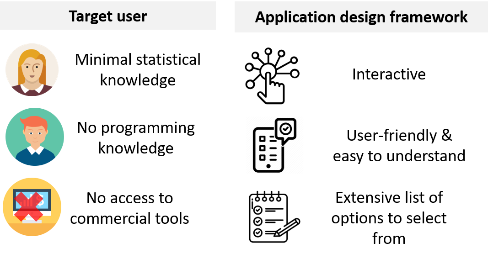
```

```{r, echo=FALSE, out.width="80%", fig.align='center'}
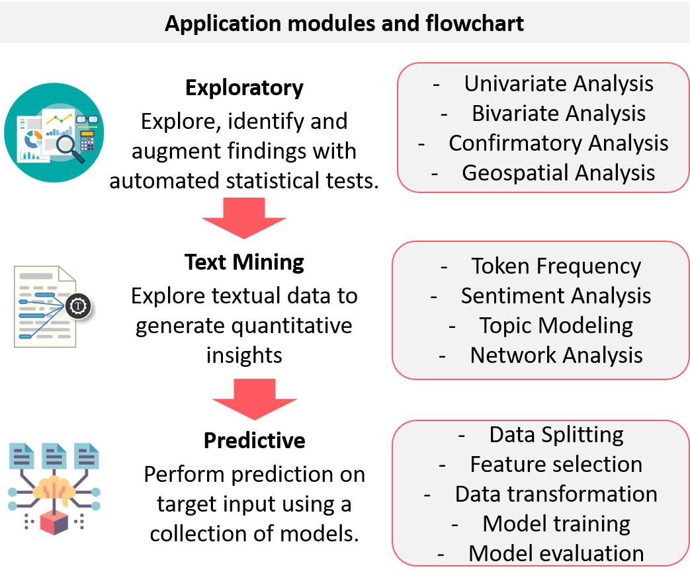
```

```{r, echo=FALSE, out.width="70%", fig.align='center'}
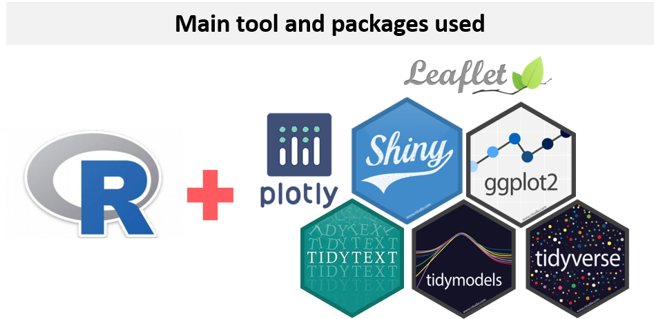
```

# Exploratory 
**Summary of dataset**  
- Interactive table allows selection and filter of variables 
```{r, echo=FALSE, out.width="90%"}
include_graphics("images/explore1.png")
```

**Exploratory Geospatial Analysis**  
- Choropleth map - shows summary of listings by Singapore neighbourhood.  
- Point symbol map - shows the distribution of listings throughout Singapore.  
```{r, echo=FALSE, out.width="90%"}
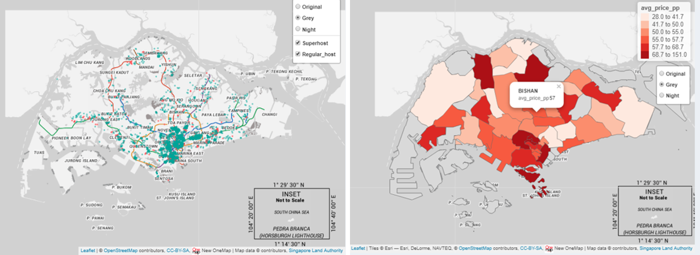
```

**Exploratory and confirmatory analysis**  
- Panel on the left allows user to seamlessly toggle between different charts.  
- Automated statistical results based on selected variables.  
- Interactive plots - user can select, pan, zoom and download plot.  
```{r, echo=FALSE, out.width="90%"}
include_graphics("images/explore3.png")
```


# Text

**Token Frequency**  
- Word Cloud allows visualisation of qualitative data by showing the frequency of appearance of a particular word in Airbnb reviews.   
- Bar chart sorts the frequency of word in descending order.   
- Unigram/Bigram allow user to understand reviews in various forms.  
```{r, echo=FALSE, out.width="90%"}
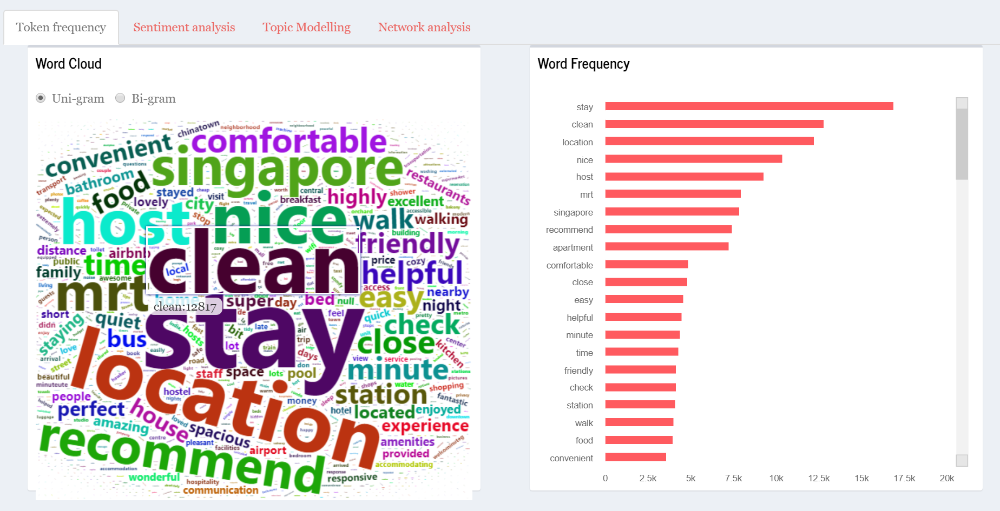
```

**Sentiment Analysis**  
- Word Clouds are based on sentiments leixcons.  
- For AFINN, the mean score and frequency of words are shown in either positive (>0) or negative (<0).  
- For BING, the count of the words are shown.  
- FOR NRC, radial plot to show the tendency of sentiments is shown.  
```{r, echo=FALSE, out.width="90%"}
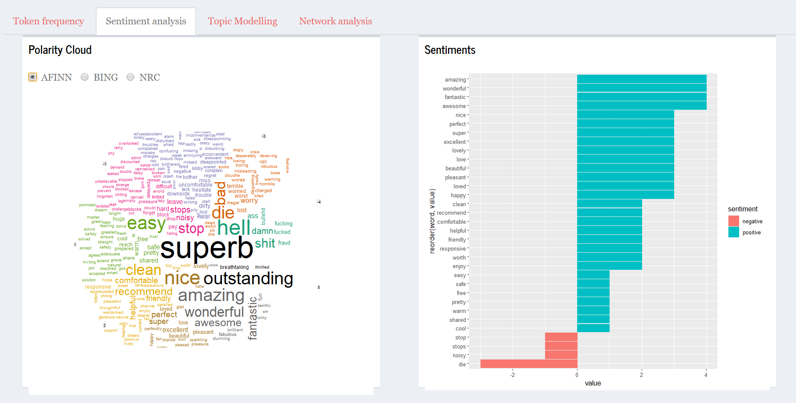
```

**Topic Modelling**  
- Topic Modeling help users interpret the topics that has been fit to a corpus of Airbnb data.   
- The left panel shows a global view of topic model to show the prevalence of each topic, and how topics relate to each other.  
- The right panel shows horizontal barchar where the length of the bars represent individual terms that are most useful in interpreting the selected topic. This enable users to understand the meaning behind each topic.  
```{r, echo=FALSE, out.width="100%"}
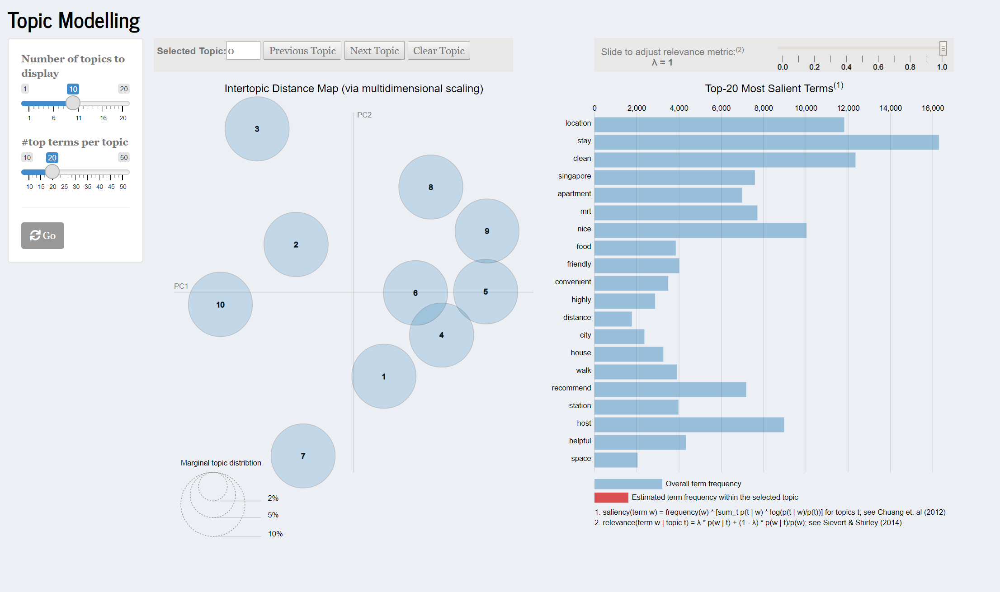
```

**Network Analysis**  
- Bidirectional network - Utilising the concept of nodes, edges and text,we can observe the connections between words. To make visualisation interpretable, only the top 100 words are shown.    
- Correlation Network -  Users can observe words that tend to co-occur within particular documents/topics even if they don't exist in the same sentence.  
```{r, echo=FALSE, out.width="80%"}
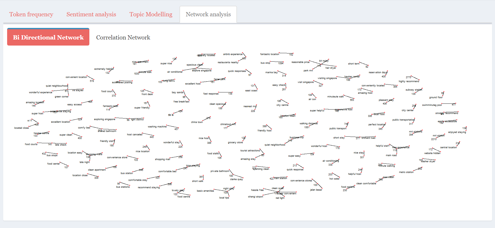
```

# Predictive
**Data splitting**  
- Proportion of training data are customisable with distribution plot between train-test set displayed for awareness of potential bias.  
```{r, echo=FALSE, out.width="90%"}
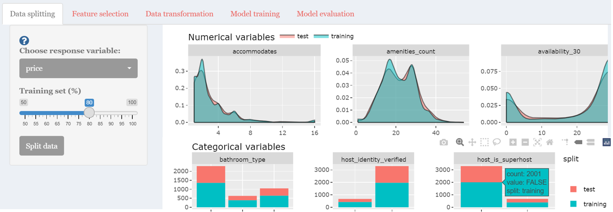
```

**Feature selection**  
- Interactive correlation matrix plot with options for different p-value and correlation method.  
- Comparison of variable importance from Random Forest and Boruta method.  
```{r, echo=FALSE, out.width="90%"}
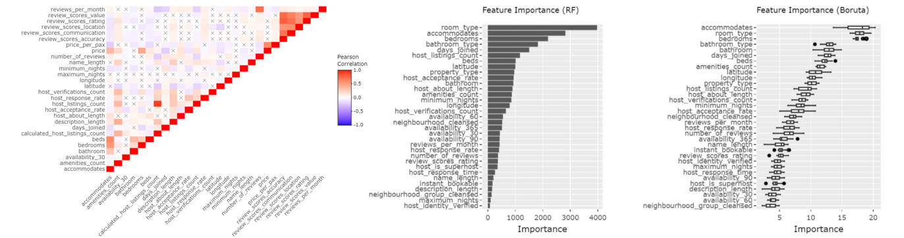
```

**Variable selection and transformation**  
- Multi-input form for variable selection and transformation steps information display.  
- Pre and post transformation data distribution plot for numerical variables.  
```{r, echo=FALSE, out.width="90%"}
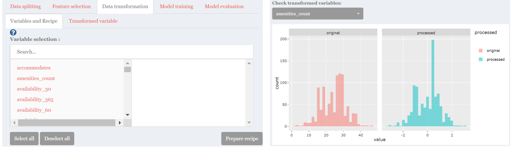
```

**Model training and validation**  
- A selection of model types to choose for developing predictive model with interactive plots for training and validation results.  
- Prediction error evaluation by comparing training data distribution and high error cases, with top predictors selected by user.  
```{r, echo=FALSE, out.width="90%"}
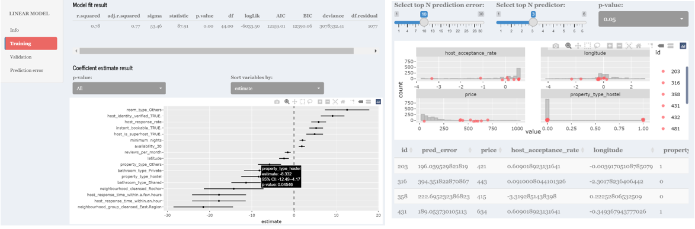
```

**Model selection**  
- Comparison of models based on performance metrics with option to select the best model for prediction.  
- Using the selected model, predictors value can be adjusted to predict the target variable.  
```{r, echo=FALSE, out.width="90%"}
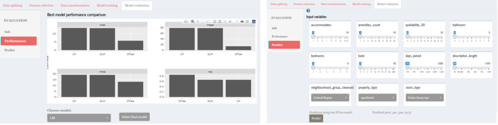
```

# Further work
- Include a data load and wrangling function to accommodate different datasets.
- Combine text and explore modules with coordinated linked views for multi-dimensional exploration.
- More predictive models such as neural network and classification workflow can be included to provide user with wider predictive analytics selection.  

```{r, include=FALSE}
knitr::write_bib(c('knitr','rmarkdown','posterdown','pagedown'), 'packages.bib')
```
