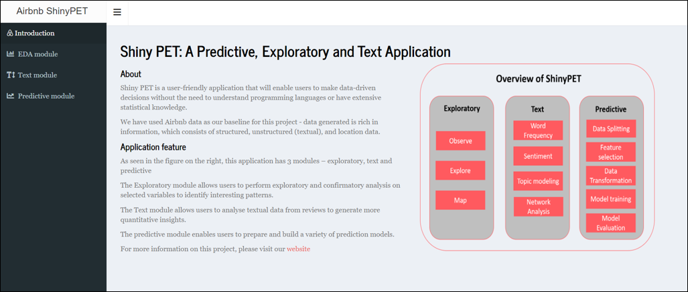
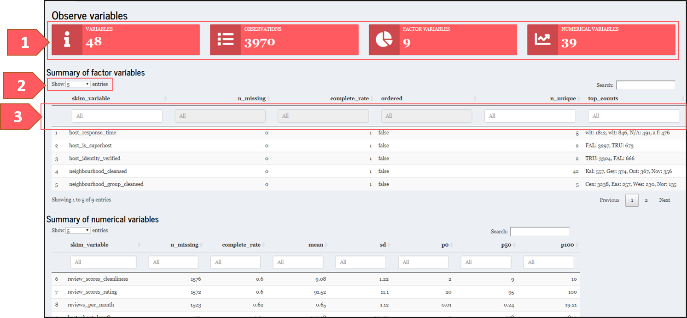
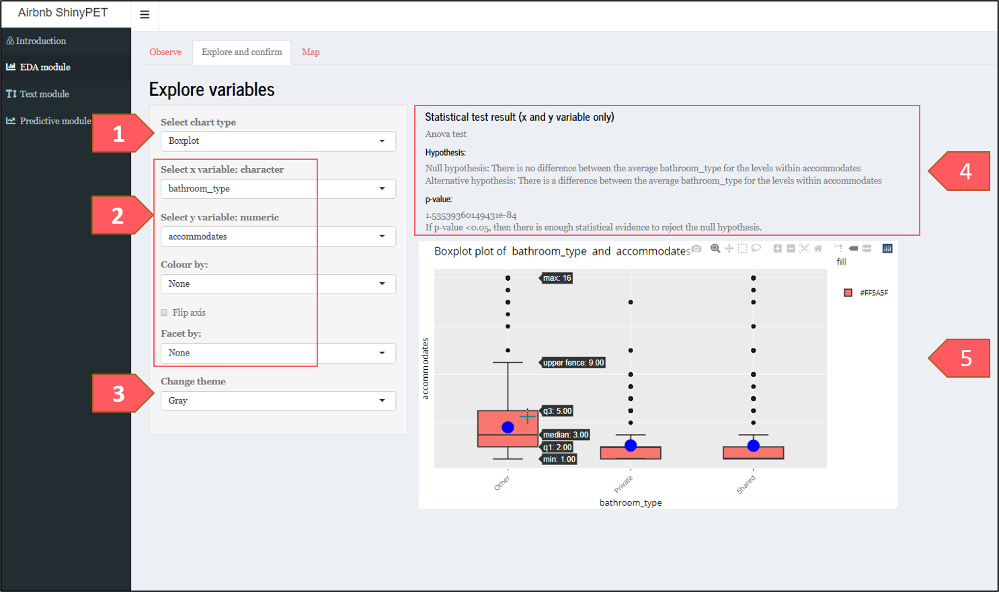

```{r setup, include=FALSE}
library(knitr)
knitr::opts_chunk$set(echo = TRUE) 
```

# User Guide for Shiny PET 

## 1. Landing Page

```{r, echo=FALSE, fig.align='center', fig.cap='Landing page of Shiny PET', out.width="100%"}

```

The landing page of the application provides a brief background for this application, its features and overview of its navigation.

## 2. Exploratory

### 2.1 Observe

This tab allows user to quickly understand the data to be analysed.

```{r, echo=FALSE, fig.align='center', fig.cap='Observe tab of Explore module', out.width="100%"}

```

[1] Shows the summary of data.

[2] Change number of observations shown. To minimize having to constantly select "Next" to view hidden variables, users can show the maximum entries (i.e 100) to be displayed.

[3] Search data if necessary.

### 2.2 Explore and Confirm

This tab allows users to perform exploratory and confirmatory analysis.

#### Performing exploratory and confirmatory analysis

```{r, echo=FALSE, fig.align='center', fig.cap='Explore and Confirm tab of Explore module',out.width="95%"}

```

[1] Select chart type.

[2] Select the variables that you are interested in analysing.

[3] This changes the background of the graph.

[4] The type of statistical tests are automated based on user's x and y variables. Simply select the variables you wish to analyse.

If p-value is less than the alpha (1 - confident interval), you reject the null hypothesis and accept the alternative hypothesis. 

[5] Hover over chart to view details.


#### Transition between chart types

```{r, echo=FALSE, fig.align='center', fig.cap='Explore and Confirm tab of Explore module',out.width="95%"}
include_graphics("images/explore2.png")
```

[1] There are 4 types of chart:

i) distribution (for univariate analysis)  
ii) Boxplot (factor and numeric variables)  
iii) Mosaic (both factor variables)  
iv) Scatter (both numeric variables)  

[2] Selection available will change according to chart type.
 
[3] Statistical test options available will change according to chart type.


### 2.3 Map

This tab allows user to explore 

## 3. Text

## 4. Predictive