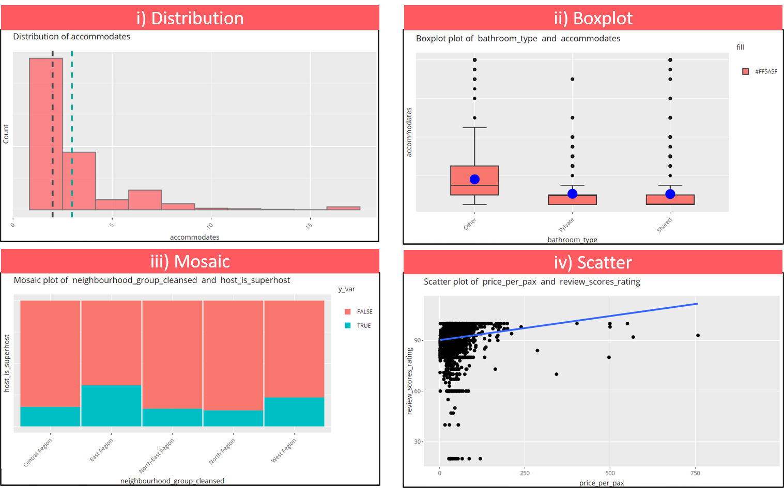
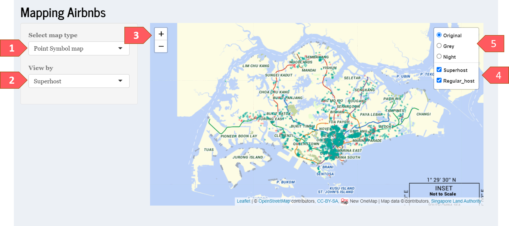
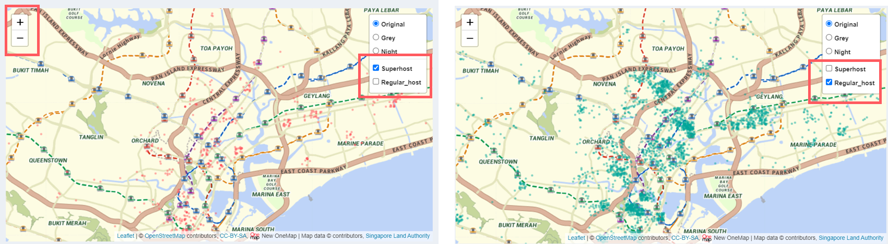
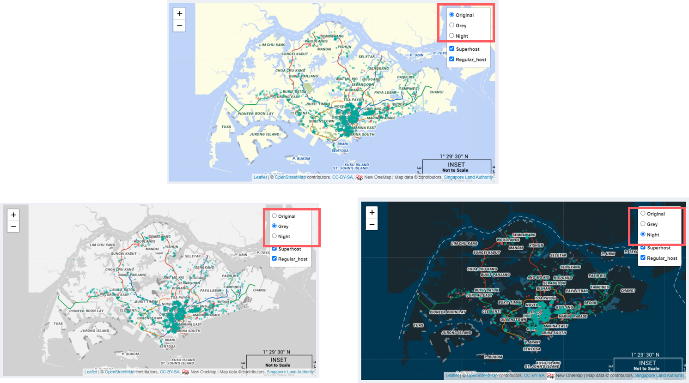
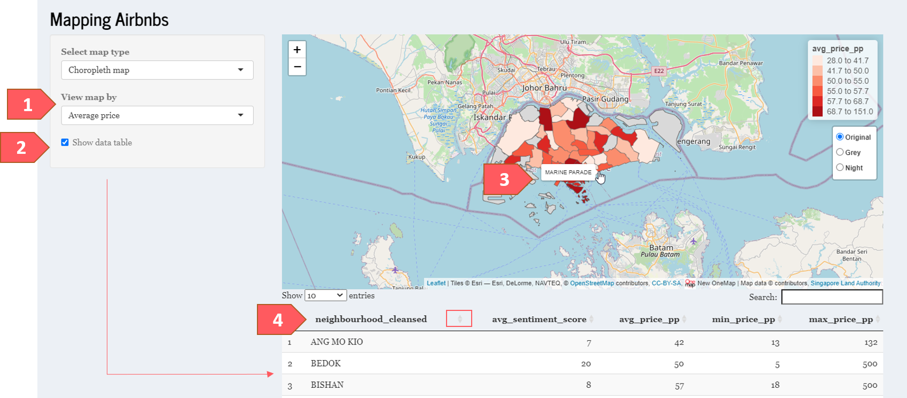

```{r setup, include=FALSE}
library(knitr)
knitr::opts_chunk$set(echo = FALSE, fig.pos = "H", fig.align='center')
```

\newpage

# User Guide for Shiny PET 

## 1. Landing Page

```{r, echo=FALSE, fig.align='center', fig.cap='Landing page of Shiny PET', out.width="100%"}
include_graphics("images/intro.png")
```

The landing page of the application provides a brief background for this application, its features and overview of its navigation.

## 2. Exploratory

### 2.1 Observe

This tab allows user to quickly understand the data to be analysed.

```{r, echo=FALSE,fig.show='hold', fig.align='center', fig.cap='Observe tab of Explore module', out.width="100%"}
include_graphics("images/observe.png")
```

[1] Shows the summary of data.

[2] Change number of observations shown. To minimize having to constantly select "Next" to view hidden variables, users can show the maximum entries (i.e 100) to be displayed.

[3] Search data if necessary.

### 2.2 Explore and Confirm

This tab allows users to perform exploratory and confirmatory analysis.

#### Types of chart available  

User can explore the dataset using different charts.

```{r, echo=FALSE,fig.align='center', fig.cap='Explore and Confirm tab of Explore module',out.width="95%"}
include_graphics("images/explore2.png")
```


[1] There are 4 types of chart:


```{r, echo=FALSE, fig.align='center', fig.cap='Four types of charts available',out.width="80%"}

```

i) Distribution - to analyse a single variable (univariate analysis).
- teal line refers to mean  
- black line refers to median

ii) Boxplot - to analyse 1 factor and 1 numeric variables
- Blue cirlce refers to mean

iii) Mosaic - to analyse two factor variables  

iv) Scatter - to analyse two numeric variables  

[2] Selection available will change according to chart type.  
 
[3] Statistical test options available will change according to chart type.

#### Performing exploratory and confirmatory analysis  

```{r, echo=FALSE, fig.align='center', fig.cap='Explore and Confirm tab of Explore module',out.width="100%"}
include_graphics("images/explore1.png")
```

[1] Select chart type.

[2] Select the variables that you are interested in analysing.

[3] This changes the background of the graph.

[4] The type of statistical tests are automated based on user's x and y variables. Simply select the variables you wish to analyse.  

If p-value is less than the alpha (1 - confident interval), you reject the null hypothesis and accept the alternative hypothesis. 

**Note:** Statistical test is only applicable to selected x and y variable, and does not take colour and facet variables into consideration. 

[5] User can also hover over chart to view details.


### 2.3 Map

This tab allows user to explore the geographic patterns of Airbnb listings through 2 thematic maps - point symbol and choropleth.

#### Point Symbol map  

Each point on the map is a listing. This allows user to see how distributed Airbnbs are throughout Singapore.  

```{r, echo=FALSE, fig.align='center', fig.cap='Point Symbol Map',out.width="100%"}

```

[1] Select map type. Map will auto update upon selection.

[2] Select between superhost and room type. This shows the listings by selected variables. 

[3] Zoom in and out the map.

```{r, echo=FALSE, fig.align='center', fig.cap='View selected listings',out.width="100%"}

```

[4] User can check and uncheck to view selected listings.

```{r, echo=FALSE, fig.align='center', fig.cap='3 types of background colour',out.width="100%"}

```

[5] User can select between different background.    
  
#### Choropleth map  


```{r, echo=FALSE, fig.align='center', fig.cap='Choropleth map',out.width="100%"}

```


[1] Select between average price and average sentiment score. The average sentiment score is calculated based on the positive and negative of guests' reviews. For more details on sentiment of reviews, please fer to the Text module > Sentiment Analysis tab.

[2] User can decide whether to view the data by checking / unchecking the 'Show data table' box.

[3] Hover over the area to see neighbourhood names.

[4] User can sort table according to needs.


## 3. Text

## 4. Predictive